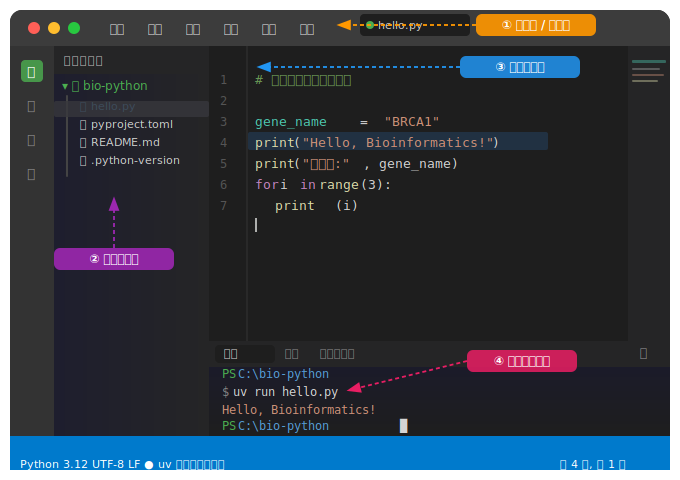
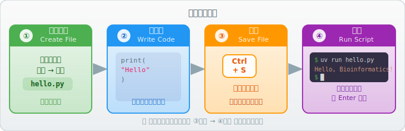
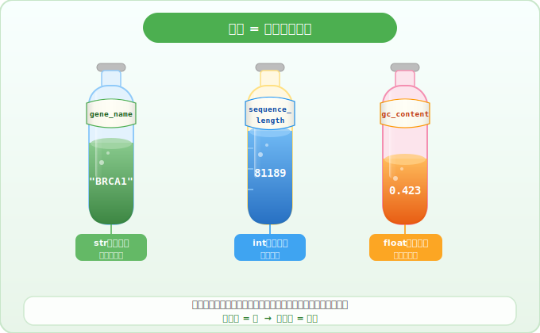
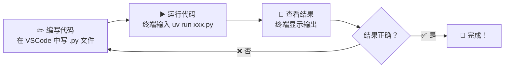

# 第1章：启程 —— 环境搭建与第一行代码

## 1.1 什么是编程？

如果你学过分子生物学，理解编程就很容易——

| 生物学 | 编程 |
|--------|------|
| **DNA** — 储存遗传指令 | **代码（.py 文件）** — 储存你写的指令 |
| **RNA + 核糖体** — 读取并执行指令 | **Python 解释器** — 读取并执行代码 |
| **蛋白质** — 最终产物 | **程序输出** — 运行结果（图表、数据、文字……） |

> 编程 = **用一种计算机能懂的语言，把你想让它做的事情写下来。**
>
> Python 就是目前生物信息学领域最流行的那种"语言"。

---

## 1.2 环境搭建（一步一步来）

### 1.2.1 终端 —— 你的"实验操作台"

在实验室里，你需要一张操作台来放移液枪、离心机、试剂……

在计算机里，**终端（Terminal）** 就是你的操作台。你在这里输入命令，计算机就执行。

**什么是"命令"？** 命令就是**文字版的按钮**。在图形界面里你用鼠标点按钮，在终端里你输入一行文字，然后按 **Enter 键**执行——效果一样，但终端能做的事情更多。

在 Windows 11 中，终端就是 **PowerShell**。

**打开方式（任选其一）：**

1. **快捷键**：按 `Win + X`，然后选择 **"终端"** 或 **"Windows PowerShell"**
2. **搜索**：按 `Win` 键，输入 `PowerShell`，点击打开
3. **右键菜单**：在桌面或文件夹空白处右键 → **"在终端中打开"**

**打开后你会看到什么？**

一个深色窗口，最下方有一行类似这样的文字：

```
PS C:\Users\你的用户名>
```

这叫**提示符**，含义是：

- `PS` — 表示这是 PowerShell
- `C:\Users\你的用户名` — 你当前所在的文件夹路径（就像你在实验室几号房间）
- `>` — 光标在这里闪烁，等你输入命令

**你需要做的就是：在 `>` 后面输入命令，然后按 `Enter` 键执行。**

### 1.2.2 uv —— Python 的"试剂管理系统"

做实验需要各种试剂，你需要一个系统来管理它们：采购、分类、记录批号……

写 Python 也需要各种"包"（别人写好的工具库），**uv** 就是帮你管理 Python 版本和这些包的工具。

> **uv** 是一个现代化的 Python 包管理器，速度极快，使用简单。

**安装 uv：**

打开 PowerShell，粘贴以下命令并按 `Enter`：

> **如何粘贴命令？** 先复制上面的命令（选中文字后 `Ctrl+C`），然后在 PowerShell 窗口里**右键单击**即可粘贴（部分版本也支持 `Ctrl+V`）。

```powershell
powershell -ExecutionPolicy ByPass -c "irm https://astral.sh/uv/install.ps1 | iex"
```

安装完成后，**关闭并重新打开** PowerShell（这一步不能省，否则系统找不到 uv），然后输入：

```powershell
uv --version
```

**怎么判断安装成功？** 如果终端显示出版本号，比如：

```
uv 0.6.12 (be2facaa7 2025-04-09)
```

说明安装成功。版本号不必和这里完全一样，只要显示了就行。

> **如果失败了怎么办？**
>
> - 看到红色报错 `无法连接` / `Timeout`？→ 网络问题，检查是否连上了 Wi-Fi 或开着代理，重试一次。
> - 看到 `权限不足` / `Access Denied`？→ 右键 PowerShell 图标，选择 **"以管理员身份运行"**，再试。
> - 输入 `uv --version` 提示 `不是可识别的命令`？→ 你忘了重新打开 PowerShell，关掉重开。

### 1.2.3 用 uv 创建项目

在 PowerShell 中**逐行**执行（每输入一行按一次 `Enter`）：

```powershell
# 1. 进入桌面文件夹
cd ~/Desktop

# 2. 创建一个新项目
uv init bio-python

# 3. 进入项目文件夹
cd bio-python
```

**逐行解释：**

| 命令 | 做了什么 |
|------|---------|
| `cd ~/Desktop` | `cd` = **c**hange **d**irectory（切换目录），`~` 代表你的用户主文件夹，`Desktop` 就是桌面。合起来：**去到桌面** |
| `uv init bio-python` | 在桌面上创建一个名为 `bio-python` 的新项目文件夹 |
| `cd bio-python` | 进入刚创建的项目文件夹 |

> **小贴士**：`uv init` 会自动帮你安装合适的 Python 版本，不需要你自己去官网下载。
>
> **如果你已经下载了本教程的代码仓库**，可以跳过 `uv init` 步骤，直接在终端中用 `cd` 进入已下载的 `bio-python` 文件夹即可。

**执行 `uv init` 后，项目文件夹里会自动生成这些文件：**

```
bio-python/
├── .python-version   ← 记录使用的 Python 版本
├── pyproject.toml    ← 项目配置文件（相当于实验的"总方案"）
└── README.md         ← 项目说明文档
```

> 现在不需要理解每个文件的作用，后面会逐步接触。你只要知道 `uv init` 帮你把"实验室"搭好了。

### 1.2.4 VSCode —— "实验记录本 + 显微镜"的结合体

- **实验记录本**：你在里面写代码（就像写实验方案）
- **显微镜**：它能帮你检查代码、高亮语法、提示错误

**安装步骤：**

1. 访问 [https://code.visualstudio.com](https://code.visualstudio.com)，下载并安装
2. 打开 VSCode，点击左侧栏的 **扩展图标**（四个方块的图标）
3. 搜索 **`Python`**（Microsoft 出品），点击 **安装**
4. 搜索 **`Chinese (Simplified)`**，安装中文语言包（可选）

**打开项目：**

菜单栏 → 文件 → 打开文件夹 → 选择刚才创建的 `bio-python` 文件夹。

**打开后你会看到什么？**

VSCode 界面分为几个核心区域：



- **左侧边栏**：显示项目里所有文件，点击文件名即可打开编辑
- **编辑区**：写代码的地方，占据界面最大面积
- **底部终端**：和你之前打开的 PowerShell 一样，可以在这里运行命令

> **如何在 VSCode 中打开终端？** 按快捷键 `` Ctrl+` ``（键盘左上角 Esc 下面那个键），或菜单栏 → 终端 → 新建终端。

### 1.2.5 创建 .py 文件并运行 —— 你的"第一个实验方案"

| 实验室 | 编程 |
|--------|------|
| Protocol（实验方案） | `.py` 文件（Python 脚本） |
| 一步步写：加试剂 → 孵育 → 离心 → 检测 | 一行行写：读数据 → 处理 → 计算 → 输出 |

**完整操作流程：**



**详细步骤：**

1. 在 VSCode **左侧文件浏览器**的空白处**右键** → 点击 **"新建文件"**
2. 输入文件名 `hello.py`，按 **Enter** 确认
3. 此时右侧编辑区会打开这个空文件，输入你的代码
4. 按 `Ctrl+S` **保存**（非常重要！不保存就运行会用旧内容）
5. 在底部终端输入 `uv run hello.py`，按 **Enter** 运行

---

## 1.3 第一行代码：print()

`print()` 是 Python 中最基础的函数，作用是**把内容显示在屏幕上**。

```python
print("Hello, Bioinformatics!")
```

在 VSCode 中写好并保存后（`Ctrl+S`），在底部终端中输入：

```powershell
uv run hello.py
```

你会在终端看到输出：

```
Hello, Bioinformatics!
```

> 恭喜！你已经让计算机执行了你的第一条"实验指令"。

**print() 还能做更多：**

```python
# 打印多个值，用逗号分隔，输出时自动加空格
print("基因:", "BRCA1", "长度:", 81189)
# 输出: 基因: BRCA1 长度: 81189

# 用 f-string 格式化输出（后面会大量使用）
gene = "TP53"
print(f"抑癌基因 {gene} 是研究最多的基因之一")
# 输出: 抑癌基因 TP53 是研究最多的基因之一
```

> `f"..."` 叫 **f-string**：在引号前加一个 `f`，就能在字符串里用 `{变量名}` 插入变量的值。这个技巧后面几乎每章都会用到。

---

## 1.4 变量 —— 贴了标签的试管

实验室里，你会在试管上贴标签来标记内容：

- 试管 A → 装着 DNA 样本
- 试管 B → 装着引物

编程里，**变量**就是贴了标签的试管：



```python
gene_name = "BRCA1"          # 试管上贴的标签是 gene_name，里面装的是 "BRCA1"
sequence_length = 81189      # 标签是 sequence_length，里面装的是数字 81189
gc_content = 0.423           # 标签是 gc_content，里面装的是小数 0.423
```

**变量可以重新赋值**——试管可以倒掉原来的，换上新的：

```python
sample = "DNA"
print(sample)    # 输出: DNA

sample = "RNA"   # 把原来的倒掉，换成新的
print(sample)    # 输出: RNA
```

**用 f-string 打印变量：**

```python
gene_name = "BRCA1"
length = 81189
print(f"基因名: {gene_name}, 长度: {length} bp")
# 输出: 基因名: BRCA1, 长度: 81189 bp
```

**命名规则（标签怎么写）：**

- 只能用英文字母、数字、下划线 `_`
- 不能以数字开头
- 建议用有意义的英文名，多个单词用下划线连接（如 `gene_name`）

---

## 1.5 注释 —— 实验记录的备注

注释是写给**人**看的，Python 会自动忽略它。用 `#` 开头：

```python
# 这是一条注释，Python 不会执行它
print("TP53")  # 打印抑癌基因名称
```

> 养成写注释的习惯，就像在 Protocol 旁边写备注一样重要。

---

## 1.6 常见错误和解决办法

初学者最容易犯的三个错误：

| 错误 | 示例 | 报错信息 | 解决办法 |
|------|------|---------|---------|
| **拼错函数名** | `prnt("hello")` | `NameError: name 'prnt' is not defined` | 仔细检查拼写，`print` 不是 `prnt` |
| **忘了引号** | `print(hello)` | `NameError: name 'hello' is not defined` | 文本必须用引号包裹：`print("hello")` |
| **中英文标点混用** | `print（"hello"）` | `SyntaxError` | Python 只认英文标点：`(` 不是 `（`，`"` 不是 `"` |

> **看到报错不要慌**。报错信息就像实验失败后的记录——它在告诉你哪里出了问题。仔细阅读最后一行的错误描述，往往就能找到原因。

---

## 1.7 从写代码到看结果



这个循环你会重复无数次——**写、跑、看、改**，这就是编程的日常。

---

## 1.8 本章小结

| 概念 | 生物学类比 | 说明 |
|------|-----------|------|
| 终端（PowerShell） | 实验操作台 | 输入命令的地方 |
| uv | 试剂管理系统 | 管理 Python 和各种包 |
| VSCode | 实验记录本 + 显微镜 | 写代码、查错的工具 |
| .py 文件 | 实验方案（Protocol） | 存放代码的文件 |
| `print()` | 把结果写到记录本上 | 在屏幕上显示内容 |
| 变量 | 贴了标签的试管 | 给数据取个名字，可以重新赋值 |
| f-string | 填空题模板 | `f"...{变量}..."` 格式化输出 |
| 注释 `#` | Protocol 旁的备注 | 给人看的说明文字 |

---

> **下一章预告**：第2章《数据的容器》—— 我们将学习 Python 的数据类型与数据结构，就像认识实验室里不同类型的容器（试管、烧瓶、培养皿……），不同的数据需要不同的"容器"来存放。
