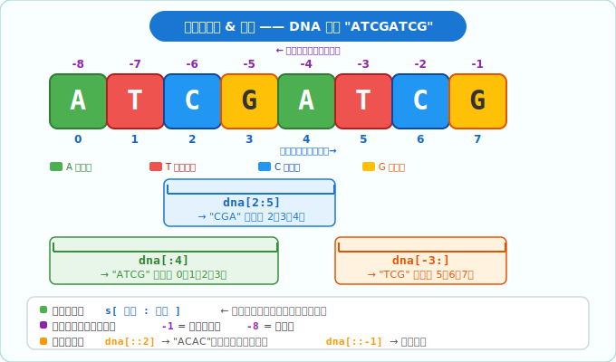
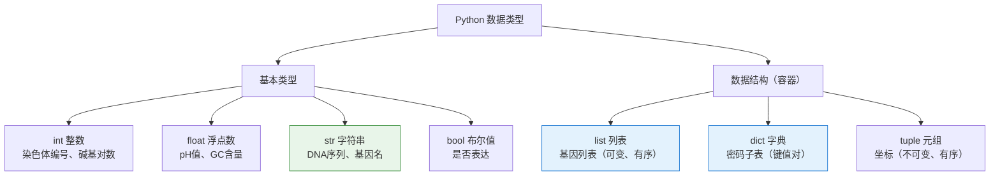
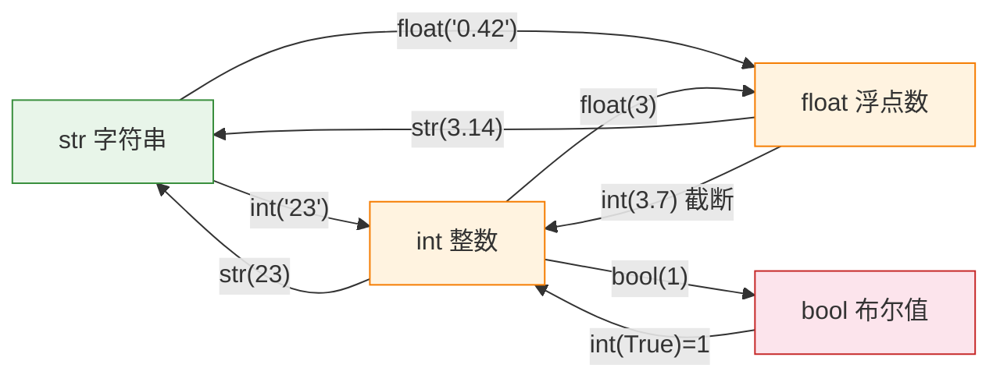
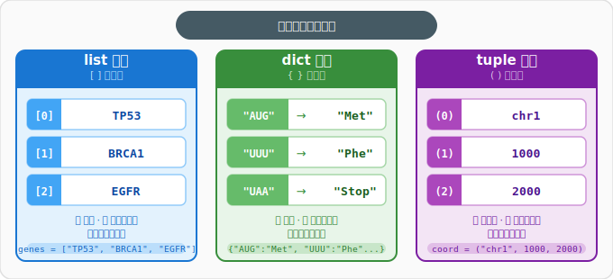

# 第2章：数据的容器 —— 数据类型与数据结构

> **回顾**：第1章我们搭好了环境，写出了第一行 `print()`。现在来认识 Python 中"装数据"的各种容器。
>
> **核心问题**：在生物信息学中，我们要处理 DNA 序列、基因列表、密码子表……Python 用什么方式来"装"这些数据？

---

## 2.1 基本数据类型

Python 中一切皆"对象"，每个对象都有自己的**类型（type）**。可以用 `type()` 函数查看。

### 2.1.1 整数 `int`

存放**没有小数点**的数字。

```python
chromosome_num = 23          # 人类染色体数目
base_pairs = 3_200_000_000   # 人类基因组碱基对数量（下划线提高可读性）
print(type(chromosome_num))  # <class 'int'>
```

> **生物类比**：染色体编号、碱基对计数、序列长度……凡是"数个数"的场景都用 `int`。

### 2.1.2 浮点数 `float`

存放**带小数点**的数字。

```python
ph_value = 7.4        # 血液 pH 值
gc_content = 0.42     # GC 含量（42%）
print(type(ph_value)) # <class 'float'>
```

> **注意**：浮点数存在精度问题，`0.1 + 0.2` 的结果是 `0.30000000000000004`，不是精确的 `0.3`。日常使用影响不大，但做精密计算时需留意。

### 2.1.3 字符串 `str` ⭐ 重点

#### 为什么字符串是生信的核心？

生物信息学的研究对象——DNA 序列（`"ATCGATCG"`）、RNA 序列（`"AUCGAUCG"`）、蛋白质序列（`"MVLSPADKTNVK"`）——**本质上全是字符串**。FASTA/FASTQ 文件、基因名、物种名也都以字符串形式存储。掌握字符串操作，就掌握了生信编程的地基。

```python
dna = "ATCGATCG"
gene_name = 'TP53'
description = "这是一个抑癌基因"
```

#### 字符串是"不可变序列"

字符串一旦创建，里面的字符**不能单独修改**（和列表不同）。

#### 字符串常用操作

| 操作 | 语法 | 示例 | 结果 |
|------|------|------|------|
| 长度 | `len(s)` | `len("ATCG")` | `4` |
| 拼接 | `s1 + s2` | `"AT" + "CG"` | `"ATCG"` |
| 重复 | `s * n` | `"AT" * 3` | `"ATATAT"` |
| 大写 | `s.upper()` | `"atcg".upper()` | `"ATCG"` |
| 小写 | `s.lower()` | `"ATCG".lower()` | `"atcg"` |
| 计数 | `s.count(x)` | `"AATCGA".count("A")` | `3` |
| 替换 | `s.replace(a, b)` | `"ATCG".replace("T", "U")` | `"AUCG"` |
| 查找 | `s.find(x)` | `"ATCGATCG".find("GAT")` | `3` |
| 包含 | `x in s` | `"ATG" in "AATCGATG"` | `True` |

> **生物应用**：`replace("T", "U")` 就是 DNA → RNA 的转录！`count("G")` 可以统计碱基频率。

#### `in` 关键字——快速判断子序列是否存在

```python
dna_seq = "ATGCCCAAGCTGAATAGCGTAGAGGGGAAAGAATAG"

# 判断是否包含起始密码子
"ATG" in dna_seq     # True

# 判断是否包含 EcoRI 酶切位点
"GAATTC" in dna_seq  # False
```

> 后续章节的条件判断（`if "ATG" in seq:`）会大量使用这个语法。

#### `split()` 与 `join()`——拆分与拼接

处理生物信息文件时，经常需要**按分隔符拆分一行**或**把多个片段拼回一行**。

```python
# split(): 字符串 → 列表
fasta_header = ">sp|P04637|P53_HUMAN Cellular tumor antigen p53"
parts = fasta_header.split("|")
# parts = [">sp", "P04637", "P53_HUMAN Cellular tumor antigen p53"]

# join(): 列表 → 字符串
fragments = ["ATCG", "GGTA", "CCAA"]
full_seq = "".join(fragments)    # "ATCGGGTACCAA"
csv_line = ",".join(fragments)   # "ATCG,GGTA,CCAA"
```

#### 字符串切片（子序列提取）⭐

切片语法：`s[起始:终止:步长]`

- **起始**包含，**终止**不包含（左闭右开）
- 索引从 **0** 开始



```python
dna = "ATCGATCG"

dna[0]      # 'A'   —— 第一个碱基
dna[2:5]    # 'CGA' —— 第3到第5个碱基
dna[:4]     # 'ATCG' —— 前4个碱基
dna[-3:]    # 'TCG' —— 最后3个碱基
dna[::2]    # 'ACAC' —— 每隔一个取一个
dna[::-1]   # 'GCTAGCTA' —— 反转序列
```

> **生物应用**：切片就像在基因组上"截取片段"，等同于提取子序列。

#### f-string 格式化字符串

后续每章都会用到 f-string（格式化字符串），这是 Python 中最方便的"拼文字+变量"方式：

```python
seq = "ATGCCCAAGCTGA"
gc = (seq.count("G") + seq.count("C")) / len(seq) * 100

# 在字符串前加 f，大括号里放变量或表达式
print(f"序列长度: {len(seq)} bp")         # 序列长度: 13 bp
print(f"GC含量: {gc:.2f}%")               # GC含量: 46.15%
print(f"前3个碱基: {seq[:3]}")             # 前3个碱基: ATG
```

> `:.2f` 表示保留两位小数。f-string 里可以放任何合法的 Python 表达式。

### 2.1.4 布尔值 `bool`

只有两个值：`True` 和 `False`。

```python
is_expressed = True     # 基因是否表达
is_mutated = False      # 是否发生突变
print(type(is_expressed))  # <class 'bool'>
```

> **生物类比**：就像实验记录里的"是/否"判断——基因是否沉默？蛋白是否磷酸化？

### 数据类型关系图



---

## 2.2 类型转换

不同类型之间可以互相转换：

```python
# str → int
num = int("23")           # 23

# int → str
label = str(23)           # "23"

# str → float
gc = float("0.42")        # 0.42

# float → int（截断小数，不四舍五入）
count = int(3.7)          # 3
```

> **常见场景**：从文件读取数据时，所有内容默认是字符串，需要转换成数字才能做数学运算。

#### 类型转换关系图



> **注意**：`int("3.7")` 会报错！必须先 `float("3.7")` 再 `int()`，即 `int(float("3.7"))`。

---

## 2.3 核心数据结构

### 2.3.1 列表 `list` ⭐ 重点

> **类比**：试管架上的一排试管——每个试管有编号（索引），可以增加、删除、重新排列。

列表用**方括号 `[]`** 创建，元素用逗号分隔，**可以存放不同类型的数据**。

```python
genes = ["TP53", "BRCA1", "EGFR", "MYC"]
```

#### 列表索引与切片

列表的索引和切片规则**与字符串完全相同**：

```python
genes[0]      # "TP53"   —— 第一个基因
genes[-1]     # "MYC"    —— 最后一个基因
genes[1:3]    # ["BRCA1", "EGFR"]
```

#### 列表是"可变"的

与字符串不同，列表可以修改内容：

```python
genes[0] = "TP53_mutant"  # 直接修改第一个元素
```

#### 列表常用操作

| 操作 | 语法 | 说明 |
|------|------|------|
| 添加元素 | `list.append(x)` | 在末尾添加一个元素 |
| 删除末尾 | `list.pop()` | 删除并返回最后一个元素 |
| 删除指定 | `list.pop(i)` | 删除并返回索引 i 处的元素 |
| 排序 | `list.sort()` | 原地排序（修改原列表） |
| 排序 | `sorted(list)` | 返回新列表（原列表不变） |
| 长度 | `len(list)` | 返回元素个数 |
| 是否包含 | `x in list` | 返回 True/False |

```python
genes = ["TP53", "BRCA1"]
genes.append("EGFR")       # ["TP53", "BRCA1", "EGFR"]
genes.pop()                 # 返回 "EGFR"，列表变为 ["TP53", "BRCA1"]
len(genes)                  # 2
"TP53" in genes             # True
```

#### `sorted()` vs `list.sort()`

```python
expression_levels = [5.2, 1.8, 9.3, 3.1]

# sorted() —— 返回新列表，原列表不动
ranked = sorted(expression_levels)
# ranked = [1.8, 3.1, 5.2, 9.3]
# expression_levels 仍然是 [5.2, 1.8, 9.3, 3.1]

# list.sort() —— 原地修改，无返回值
expression_levels.sort()
# expression_levels 变为 [1.8, 3.1, 5.2, 9.3]
```

> **经验法则**：需要保留原始顺序时用 `sorted()`，不需要时用 `.sort()`（更省内存）。

#### 列表嵌套——二维数据的雏形

列表里可以再放列表，用于表示表格形式的二维数据：

```python
# 3个基因的表达量（3个样本）
expression_matrix = [
    [5.2, 3.1, 7.8],   # 基因 A
    [2.1, 6.5, 4.3],   # 基因 B
    [8.0, 1.2, 3.7],   # 基因 C
]

expression_matrix[0]      # [5.2, 3.1, 7.8] —— 基因 A 的所有样本
expression_matrix[0][2]   # 7.8 —— 基因 A 在第3个样本的表达量
```

> 这就是"矩阵"的雏形——后续课程中的 NumPy 数组就是它的高效升级版。

### 2.3.2 字典 `dict` ⭐ 重点

> **类比**：密码子表——每个密码子（键）对应一个氨基酸（值），通过密码子就能查到对应的氨基酸。

字典用**花括号 `{}`** 创建，存放**键值对（key: value）**。

#### 列表还是字典？判断标准

- 通过**位置/序号**访问数据 → 用**列表**（"第3个基因"）
- 通过**名字/标签**查找数据 → 用**字典**（"TP53 对应什么蛋白？"）

```python
# 一个更完整的密码子表片段
codon_table = {
    "AUG": "Met",  # 起始密码子
    "UUU": "Phe",  "UUC": "Phe",
    "UUA": "Leu",  "UUG": "Leu",
    "GCU": "Ala",  "GCC": "Ala",
    "UAA": "Stop", "UAG": "Stop", "UGA": "Stop",
}
```

#### 字典常用操作

```python
# 取值：通过键获取值
codon_table["AUG"]              # "Met"

# 添加/修改
codon_table["GAU"] = "Asp"      # 添加新键值对

# 安全取值（键不存在时返回默认值，不报错）
codon_table.get("XXX", "未知")   # "未知"

# 获取所有键 / 所有值
codon_table.keys()               # dict_keys(["AUG", "UUU", ...])
codon_table.values()             # dict_values(["Met", "Phe", ...])

# 遍历字典
for codon, amino_acid in codon_table.items():
    print(f"{codon} → {amino_acid}")
```

> **重要区别**：列表用**数字索引**访问元素，字典用**键**访问值。

#### 字典推导式（预告）

与第3章将学到的列表推导式类似，字典也有推导式语法：

```python
# 统计 DNA 序列中每种碱基的数量
dna = "ATCGATCGATCG"
base_count = {base: dna.count(base) for base in "ATCG"}
# {'A': 3, 'T': 3, 'C': 3, 'G': 3}
```

> 第3章会详细讲推导式，这里先有个印象即可。

### 2.3.3 元组 `tuple`（简要了解）

> **类比**：基因组坐标 `(chr1, 1000, 2000)`——一旦确定，就不应该被修改。

元组用**圆括号 `()`** 创建，和列表类似但**不可变**。

```python
coordinate = ("chr1", 1000, 2000)
coordinate[0]    # "chr1"
coordinate[1]    # 1000
# coordinate[0] = "chr2"  # ❌ 报错！元组不可修改
```

> **何时用元组？** 当数据确定不变时用元组（如坐标、固定配置），既安全又比列表省内存。

### 三种容器对比



---

## 2.4 常见错误与排查

初学阶段最容易遇到以下三种错误，提前认识它们可以节省大量调试时间。

### `IndexError`——索引越界

```python
genes = ["TP53", "BRCA1", "EGFR"]
genes[3]   # ❌ IndexError: list index out of range
# 列表只有3个元素，最大索引是 2（从0开始）
```

**修复**：检查列表长度 `len(genes)`，确保索引在 `0 ~ len-1` 范围内。

### `TypeError`——类型不匹配

```python
age = 25
print("年龄是 " + age)  # ❌ TypeError: can only concatenate str to str
# 字符串不能直接和整数拼接
```

**修复**：用 `str(age)` 转换，或直接用 f-string：`f"年龄是 {age}"`。

### `KeyError`——字典键不存在

```python
codon_table = {"AUG": "Met", "UUU": "Phe"}
codon_table["GGG"]  # ❌ KeyError: 'GGG'
```

**修复**：用 `.get()` 安全取值——`codon_table.get("GGG", "未知")`。

---

## 2.5 本章小结

| 类型 | 关键字 | 可变？ | 生物学类比 | 适用场景 |
|------|--------|--------|------------|----------|
| 整数 | `int` | — | 碱基对数量 | 计数 |
| 浮点数 | `float` | — | GC 含量 | 测量值 |
| 字符串 | `str` | ❌ | DNA 序列 | 文本、序列 |
| 布尔值 | `bool` | — | 是否表达 | 逻辑判断 |
| 列表 | `list` | ✅ | 试管架 | 有序集合、需增删 |
| 字典 | `dict` | ✅ | 密码子表 | 键值映射、快速查找 |
| 元组 | `tuple` | ❌ | 基因组坐标 | 不变的有序数据 |

> **下一章预告**：第3章将学习**条件判断**（`if/elif/else`）和**循环**（`for/while`）——让程序能"做选择"和"重复操作"，比如遍历一条 mRNA 序列并逐个翻译密码子。还会学到强大的**列表推导式**。
