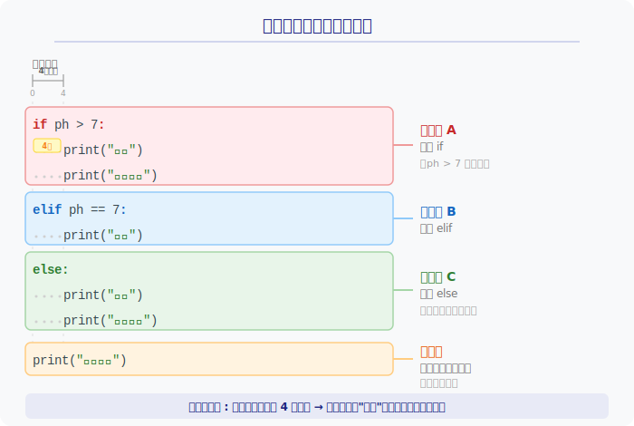
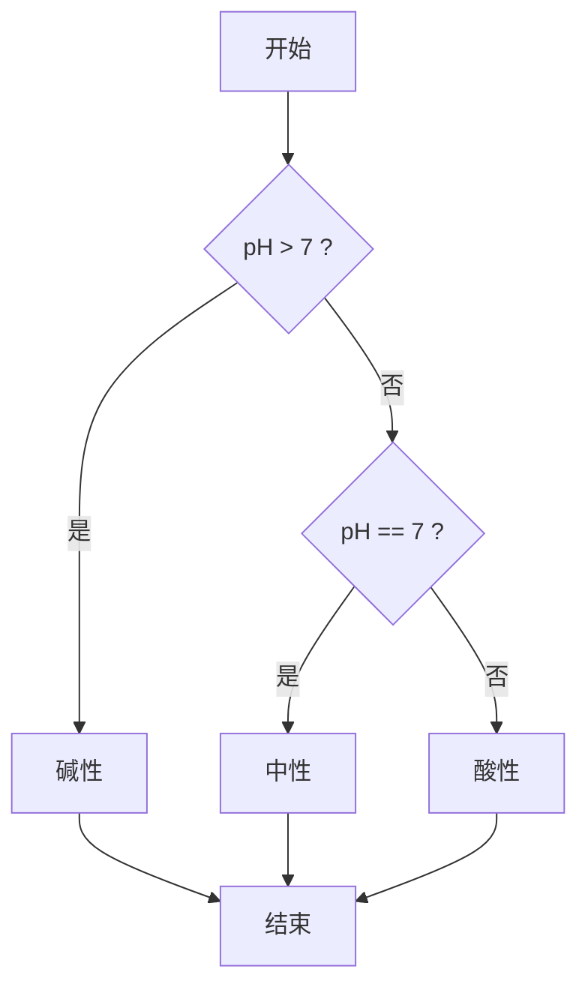
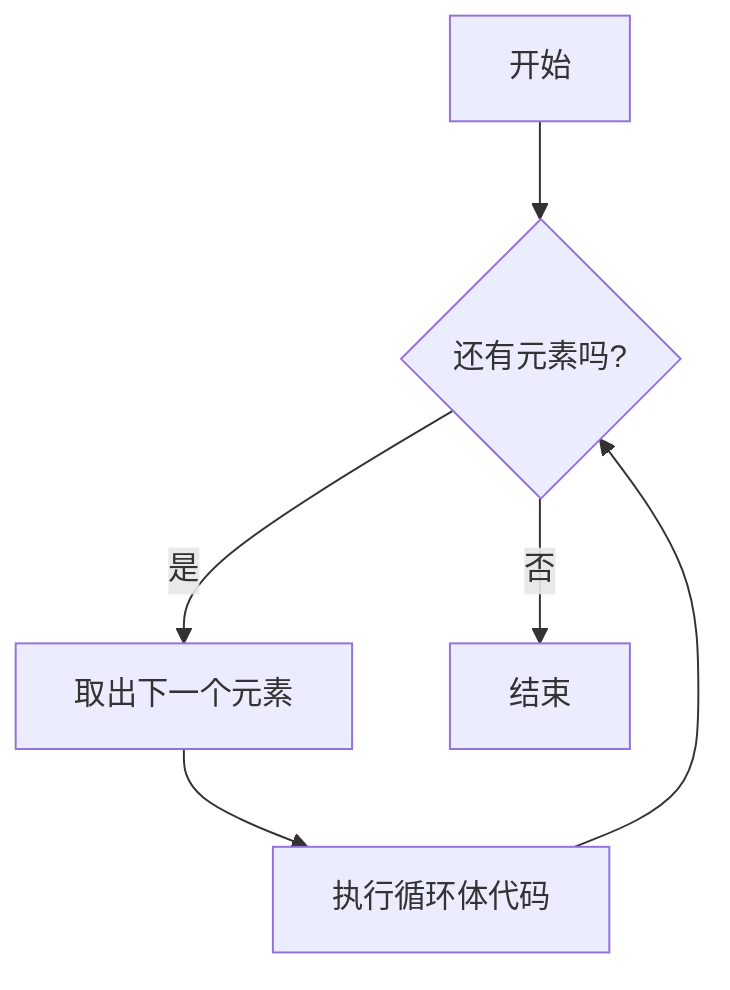

# 第3章：让程序会"思考" —— 条件判断与循环

> **核心目标**：学会让程序根据条件做出不同处理，并批量处理大量数据——这是生物信息分析的基础能力。

> **回顾**：在第2章中，我们学习了变量、字符串和列表——这些是数据的"容器"。但光有数据还不够，我们需要让程序能根据数据**做判断**、**重复操作**。本章就来学习这两项核心能力。

---

## 3.1 条件判断：if / elif / else

### 实验类比

在实验室测 pH 时，你会这样判断：

- 如果 pH > 7 → 碱性
- 如果 pH == 7 → 中性
- 否则 → 酸性

Python 用 `if / elif / else` 表达同样的逻辑：

```python
ph = 6.5

if ph > 7:
    print("碱性")
elif ph == 7:
    print("中性")
else:
    print("酸性")
```

### ⚠️ 缩进——Python 最重要的规则

**Python 用缩进（4个空格）来表示"哪些代码属于同一个块"**，而不是大括号 `{}`。你可以把缩进理解为"从属关系"——缩进的代码"属于"上面那行带冒号的语句。

下面这张图展示了缩进与代码块的关系：



> **规则**：冒号 `:` 后面换行，下一行必须缩进。同一个代码块的缩进量必须一致（统一用 4 个空格）。

#### 常见缩进错误与修复

```python
# ❌ 错误1：忘记缩进
if ph > 7:
print("碱性")
# IndentationError: expected an indented block after 'if' statement

# ✅ 修复：加上 4 个空格的缩进
if ph > 7:
    print("碱性")


# ❌ 错误2：同一代码块缩进不一致
if ph > 7:
    print("碱性")
      print("加酸中和")     # 多了2个空格！
# IndentationError: unexpected indent

# ✅ 修复：保持同一代码块的缩进量一致
if ph > 7:
    print("碱性")
    print("加酸中和")
```

### 比较运算符

| 运算符 | 含义 | 示例 |
|--------|------|------|
| `==` | 等于 | `base == "A"` |
| `!=` | 不等于 | `base != "N"` |
| `>` | 大于 | `gc_content > 0.6` |
| `<` | 小于 | `length < 100` |
| `>=` | 大于等于 | `score >= 30` |
| `<=` | 小于等于 | `ph <= 7` |

> **易错点**：`=` 是赋值，`==` 才是比较！

### 逻辑运算符

用于组合多个条件：

```python
base = "A"

# or：满足其中一个即可
if base == "A" or base == "G":
    print("嘌呤")

# not：取反
if not (base == "A"):
    print("不是腺嘌呤")
```

| 运算符 | 含义 | 示例 |
|--------|------|------|
| `and` | 且（都满足） | `ph > 6 and ph < 8` |
| `or` | 或（满足其一） | `base == "A" or base == "G"` |
| `not` | 非（取反） | `not is_valid` |

### 嵌套条件

条件里可以再嵌套条件（再缩进一层）：

```python
base = "A"

if base in "ATCG":          # 先判断是否是有效碱基
    if base in "AG":
        print("嘌呤")
    else:
        print("嘧啶")
else:
    print("无效碱基")
```

### if 判断流程图



---

## 3.2 for 循环（重点！）

### 实验类比

假设你有 1000 条 DNA 序列，需要逐条计算 GC 含量。手动做 1000 次？不，用循环让程序**批量处理**：

```python
for 序列 in 序列列表:
    计算GC含量
```

### 关于循环变量名

`for base in seq` 中的 `base` 不是固定写法——**你可以自由起名**，只要不和 Python 关键字（如 `if`、`for`、`def`）冲突即可。起一个有意义的名字能让代码更易读：

```python
seq = "ATCGGC"

# 这三种写法效果完全一样，但可读性不同
for base in seq:      # ✅ 好名字：一看就知道是碱基
    print(base)

for b in seq:         # 还行：简写，简单场景可以用
    print(b)

for x in seq:         # ❌ 差名字：看不出含义
    print(x)
```

### 遍历字符串——逐个碱基处理

DNA 序列就是字符串，`for` 可以逐个字符遍历：

```python
seq = "ATCGGC"

for base in seq:
    print(base)
# 输出：A T C G G C（每行一个）
```

### 遍历列表——逐个基因处理

```python
genes = ["BRCA1", "TP53", "EGFR"]

for gene in genes:
    print(f"正在分析基因：{gene}")
```

### range() 函数——生成数字序列

当你需要"重复 N 次"或需要数字索引时：

```python
# range(5) 生成 0, 1, 2, 3, 4
for i in range(5):
    print(f"第 {i} 号样本")

# range(1, 4) 生成 1, 2, 3
for i in range(1, 4):
    print(i)
```

### enumerate() 函数——同时获取编号和元素

分析序列时经常需要知道"这是第几个碱基"：

```python
seq = "ATCG"

for i, base in enumerate(seq):
    print(f"位置 {i}: {base}")
# 位置 0: A
# 位置 1: T
# 位置 2: C
# 位置 3: G
```

### zip() 函数——同时遍历两个列表

后面做序列比对时，经常需要把两条序列的碱基**一一配对**比较。`zip()` 就是干这个的：

```python
seq1 = "ATCG"
seq2 = "ATGG"

for base1, base2 in zip(seq1, seq2):
    if base1 == base2:
        print(f"{base1} == {base2} ✓")
    else:
        print(f"{base1} != {base2} ✗")
# A == A ✓
# T == T ✓
# C != G ✗
# G == G ✓
```

### GC 含量计算——逐步讲解

让我们用 `for` 循环一步步计算 GC 含量，理解循环中变量是如何变化的：

```python
seq = "ATGCGC"
gc_count = 0        # 计数器，记录 G 和 C 的个数

for base in seq:
    if base == "G" or base == "C":
        gc_count = gc_count + 1

gc_content = gc_count / len(seq)
print(f"GC 含量：{gc_content:.1%}")    # GC 含量：66.7%
```

下面用流程图展示循环每一步的变化：

```
序列: A  T  G  C  G  C
      ↓  ↓  ↓  ↓  ↓  ↓
步骤: 1  2  3  4  5  6

步骤1: base="A" → 不是 G/C → gc_count = 0
步骤2: base="T" → 不是 G/C → gc_count = 0
步骤3: base="G" → 是 G！   → gc_count = 1
步骤4: base="C" → 是 C！   → gc_count = 2
步骤5: base="G" → 是 G！   → gc_count = 3
步骤6: base="C" → 是 C！   → gc_count = 4

循环结束 → gc_content = 4 / 6 = 66.7%
```

### for 循环流程图



---

## 3.3 while 循环（简单了解）

`while` 在条件满足时**持续执行**，适合"不知道要循环多少次"的场景：

```python
# 模拟：不断稀释溶液直到浓度低于阈值
concentration = 100.0

while concentration > 1.0:
    concentration = concentration / 2  # 每次稀释一半
    print(f"当前浓度：{concentration:.1f}")
```

> **注意**：`while` 必须确保条件最终会变为 `False`，否则会**死循环**！

---

## 3.4 列表推导式——简洁的批量处理

列表推导式是 Python 最优雅的特性之一，一行代码完成"对每个元素做处理并收集结果"：

```python
# 传统写法：3行
result = []
for base in "ATCG":
    result.append(base.lower())

# 列表推导式：1行搞定
result = [base.lower() for base in "ATCG"]
# ['a', 't', 'c', 'g']
```

还可以加条件过滤：

```python
seq = "ATCGGCTA"

# 只提取 G 和 C
gc_bases = [b for b in seq if b in "GC"]
# ['C', 'G', 'G', 'C']
```

### 何时用列表推导式，何时用 for 循环？

| 场景 | 推荐写法 | 原因 |
|------|----------|------|
| 简单的转换或过滤（一步操作） | 列表推导式 | 简洁清晰 |
| 需要多步计算、包含复杂逻辑 | for 循环 | 可读性更好 |
| 循环体中有 `print` 或其他"副作用" | for 循环 | 推导式是用来生成列表的 |

```python
# ✅ 适合列表推导式：简单转换
upper_bases = [b.upper() for b in "atcg"]

# ✅ 适合 for 循环：多步操作
results = []
for seq in sequences:
    cleaned = seq.replace("N", "")
    gc = (cleaned.count("G") + cleaned.count("C")) / len(cleaned)
    results.append(gc)
```

---

## 3.5 break 和 continue（简单了解）

| 关键字 | 作用 | 类比 |
|--------|------|------|
| `break` | 立即跳出整个循环 | 找到目标基因后停止搜索 |
| `continue` | 跳过本次迭代，进入下一次 | 跳过无效数据，继续处理 |

```python
# break：找到第一个终止密码子就停下
codons = ["AUG", "GCU", "UAA", "GGA"]
for codon in codons:
    if codon in ["UAA", "UAG", "UGA"]:
        print(f"找到终止密码子：{codon}")
        break
    print(f"翻译密码子：{codon}")

# continue：跳过未知碱基
seq = "ATNGCA"
clean = ""
for base in seq:
    if base == "N":
        continue        # 跳过 N，处理下一个
    clean += base
print(clean)            # "ATGCA"
```

---

## 3.6 综合实战：统计 DNA 序列中各碱基数量

结合 `if` 和 `for`，实现一个完整的碱基统计程序：

```python
dna = "ATGCGATCGCTAGCATCG"

# 初始化四个计数器
count_a = 0
count_t = 0
count_g = 0
count_c = 0

# 遍历每个碱基，分类计数
for base in dna:
    if base == "A":
        count_a += 1     # += 1 等价于 count_a = count_a + 1
    elif base == "T":
        count_t += 1
    elif base == "G":
        count_g += 1
    elif base == "C":
        count_c += 1
    else:
        print(f"警告：发现未知碱基 '{base}'")

# 输出统计结果
total = len(dna)
print(f"序列长度：{total} bp")
print(f"A: {count_a} ({count_a/total:.1%})")
print(f"T: {count_t} ({count_t/total:.1%})")
print(f"G: {count_g} ({count_g/total:.1%})")
print(f"C: {count_c} ({count_c/total:.1%})")
print(f"GC 含量：{(count_g + count_c) / total:.1%}")
```

输出：

```
序列长度：18 bp
A: 4 (22.2%)
T: 4 (22.2%)
G: 5 (27.8%)
C: 5 (27.8%)
GC 含量：55.6%
```

> 这个例子综合运用了 `for` 循环、`if/elif/else` 判断、计数器变量和 f-string 格式化，是本章知识的一次完整实战。

---

## 本章小结

| 概念 | 用途 | 关键语法 |
|------|------|----------|
| `if/elif/else` | 条件分支 | `if 条件:` |
| `for` 循环 | 遍历序列/列表 | `for x in 序列:` |
| `while` 循环 | 条件满足时重复 | `while 条件:` |
| 列表推导式 | 一行批量处理 | `[表达式 for x in 序列]` |
| `break/continue` | 控制循环流程 | 在循环体内使用 |

> **下一章预告**：第4章我们将学习**函数**——把常用的分析步骤封装成可复用的工具。比如上面的"碱基统计"代码，每次用都要复制一遍？学了函数之后，只需 `count_bases(dna)` 一行调用即可！
