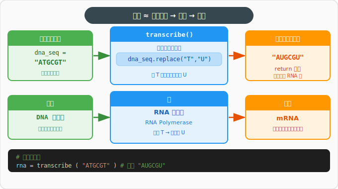
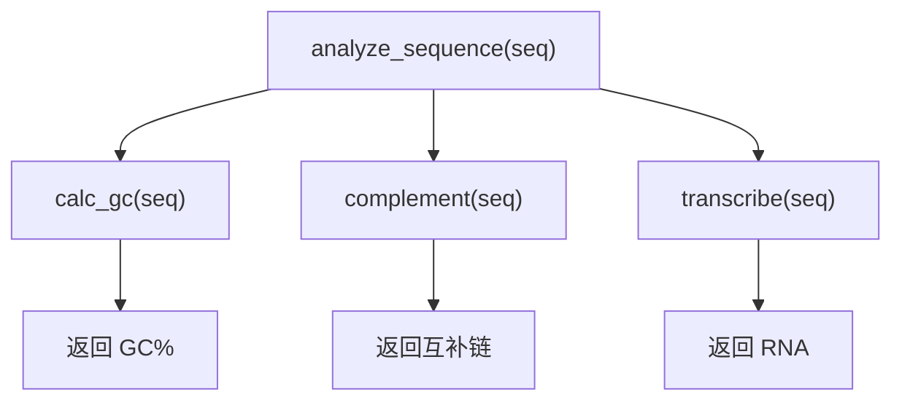
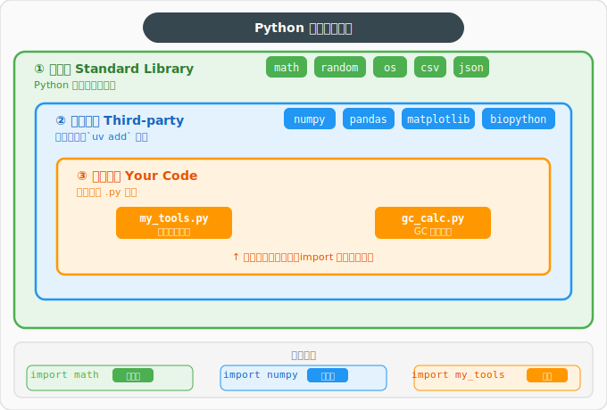
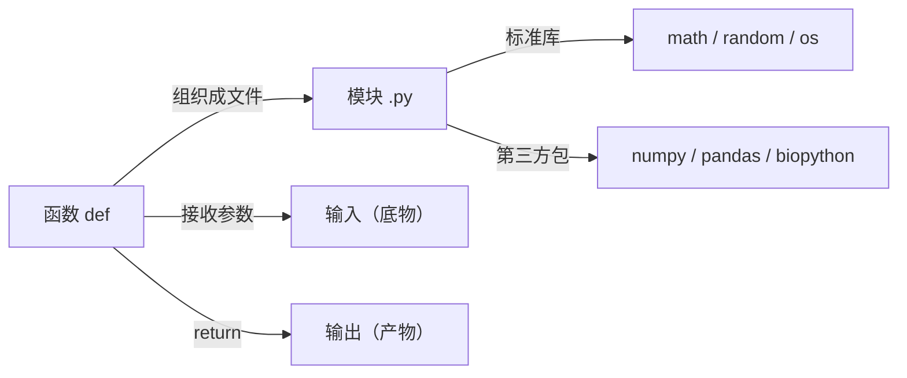

# 第4章：代码的"乐高积木" —— 函数与模块

> **回顾**：在第3章中，我们学会了用 `if` 做判断、用 `for` 做循环。但你可能已经发现一个问题——同样的代码（比如计算 GC 含量）每次都要重写一遍。本章学习的**函数**，就是解决这个问题的利器。

## 4.1 为什么需要函数？

**实验室类比：标准操作流程（SOP）**

在实验室里，每次做 PCR 都不会从头发明流程——你会翻开 SOP 手册，按照固定步骤操作。Python 的**函数**就是你的 SOP：**一次定义，反复使用**。

没有函数的代码就像没有 SOP 的实验室：每次做同样的实验都要重新想步骤，既低效又容易出错。

```python
# 没有函数：每次都要重写计算逻辑
seq1 = "ATGCGCTA"
gc1 = (seq1.count("G") + seq1.count("C")) / len(seq1)

seq2 = "TTAAGCGC"
gc2 = (seq2.count("G") + seq2.count("C")) / len(seq2)

# 有函数：定义一次，随时调用
def calc_gc(seq):
    return (seq.count("G") + seq.count("C")) / len(seq)

gc1 = calc_gc("ATGCGCTA")
gc2 = calc_gc("TTAAGCGC")
```

---

## 4.2 函数的定义与使用

### 基本语法

```python
def 函数名(参数1, 参数2):
    """文档字符串：描述这个函数做什么"""
    # 函数体：具体的操作步骤
    结果 = 某些计算
    return 结果  # 返回值
```

### 核心类比：函数就像酶



| 酶的特性         | 函数的对应         |
| ---------------- | ------------------ |
| 有固定的名称     | `def 函数名()`     |
| 接收特定的底物   | 参数（输入）       |
| 按固定机制催化   | 函数体（处理逻辑） |
| 产生特定的产物   | `return`（输出）   |
| 可以反复使用     | 可以多次调用       |

就像 DNA 聚合酶总是接收 dNTP 和模板链，产生新的 DNA 链一样——函数接收参数，返回结果。

### 参数与返回值

```python
def transcribe(dna_seq):
    """将 DNA 序列转录为 RNA 序列（T → U）"""
    rna_seq = dna_seq.replace("T", "U")
    return rna_seq

rna = transcribe("ATGCGT")
print(rna)  # AUGCGU
```

### 没有 return 的函数

不是所有函数都需要返回值。有些函数只是**执行操作**（如打印、写文件），不产生结果：

```python
def print_seq_info(seq):
    """打印序列的基本信息（不返回任何值）"""
    print(f"序列：{seq}")
    print(f"长度：{len(seq)} bp")
    print(f"GC 含量：{(seq.count('G') + seq.count('C')) / len(seq):.1%}")

print_seq_info("ATGCGCTA")
# 序列：ATGCGCTA
# 长度：8 bp
# GC 含量：50.0%

result = print_seq_info("ATGCGCTA")
print(result)  # None —— 没有 return 的函数返回 None
```

### 返回多个值

一个函数可以同时返回多个结果，Python 会自动把它们打包成**元组（tuple）**：

```python
def analyze_seq(seq):
    """返回序列的长度和 GC 含量"""
    length = len(seq)
    gc = (seq.count("G") + seq.count("C")) / length
    return length, gc          # 返回两个值

# 用两个变量分别接收
seq_len, gc_content = analyze_seq("ATGCGCTA")
print(f"长度：{seq_len}，GC 含量：{gc_content:.1%}")
# 长度：8，GC 含量：50.0%
```

### 默认参数

有些酶在特定 pH 下效率最高，但也能在其他条件下工作。默认参数就是"默认条件"：

```python
def calc_gc(seq, round_digits=2):
    """计算 GC 含量，默认保留 2 位小数"""
    gc = (seq.count("G") + seq.count("C")) / len(seq) * 100
    return round(gc, round_digits)

print(calc_gc("ATGCGCTA"))        # 使用默认值，保留 2 位 → 50.0
print(calc_gc("ATGCGCTA", 4))     # 指定保留 4 位 → 50.0
```

### 文档字符串（docstring）

每个 SOP 都有"目的"和"步骤说明"。函数的 docstring 就是它的说明书：

```python
def calc_gc(seq, round_digits=2):
    """
    计算 DNA 序列的 GC 含量。

    参数:
        seq: DNA 序列字符串（仅含 A/T/G/C）
        round_digits: 保留小数位数，默认 2

    返回:
        GC 含量百分比（float）
    """
    gc = (seq.count("G") + seq.count("C")) / len(seq) * 100
    return round(gc, round_digits)
```

使用 `help(calc_gc)` 即可查看文档。

---

## 4.3 变量作用域（局部 vs 全局）

简单理解：函数内部定义的变量是**局部变量**，只在函数内部可见，就像实验台上的临时试剂——实验结束就清理掉了。函数外部定义的变量是**全局变量**，整个脚本都能访问。

```python
gene_name = "BRCA1"  # 全局变量：整个实验室都知道

def print_info():
    length = 81189      # 局部变量：只在这个函数内有效
    print(f"{gene_name} 长度: {length} bp")

print_info()
# print(length)  # 报错！函数外面访问不到局部变量
```

> **原则**：尽量使用局部变量和参数传递数据，少用全局变量，保持代码清晰。

---

## 4.4 函数调用关系

一个函数可以调用另一个函数，就像一个完整的实验流程会调用多个子步骤：



下面给出一个**自包含**的示例，展示多个函数如何协作完成一次综合分析：

```python
def calc_gc(seq):
    return round((seq.count("G") + seq.count("C")) / len(seq) * 100, 2)

def complement(seq):
    base_map = {"A": "T", "T": "A", "G": "C", "C": "G"}
    return "".join(base_map[base] for base in seq)

def transcribe(seq):
    return seq.replace("T", "U")

def analyze_sequence(seq):
    """对 DNA 序列进行综合分析"""
    gc = calc_gc(seq)
    comp = complement(seq)
    rna = transcribe(seq)
    return {"GC含量": gc, "互补链": comp, "RNA": rna}
```

---

## 4.5 模块（Module）

### 类比：实验室的仪器柜

实验室有不同的仪器柜：数学运算柜、随机数柜、文件操作柜……Python 的**模块**就是这些分门别类的工具柜。你需要哪个工具，就从对应的柜子里取出来。

### 模块的层级关系

Python 可用的模块分三个层级，就像实验室的设备来源：



### 导入方式

```python
# 方式一：导入整个工具柜（推荐）
import math
print(math.sqrt(16))   # 4.0 —— 从 math 柜子里取 sqrt 工具

# 方式二：只拿出需要的工具
from math import sqrt, log
print(sqrt(16))         # 4.0 —— 直接使用，不用加 math. 前缀

# 方式三：给工具柜起个简短别名
import random as rd
print(rd.random())      # 生成 0~1 之间的随机数
```

### 导入报错怎么办？—— ModuleNotFoundError

如果导入时看到这个错误，说明对应的包没有安装：

```python
import numpy
# ModuleNotFoundError: No module named 'numpy'
```

**排查步骤**：
1. 确认包名拼写正确（注意：安装名和导入名有时不同，如安装 `scikit-learn`，导入用 `sklearn`）
2. 在**终端**中运行 `uv add 包名` 安装（见下一节）
3. 安装后重新运行 Python 脚本

### 常用标准库模块

| 模块      | 类比           | 常用功能                                   |
| --------- | -------------- | ------------------------------------------ |
| `math`    | 数学运算工具柜 | `sqrt()`、`log()`、`pi`、`e`               |
| `random`  | 随机数工具柜   | `random()`、`choice()`、`randint()`        |
| `os.path` | 文件管理工具柜 | `join()`、`exists()`、`basename()`         |

---

## 4.6 第三方包

### 什么是第三方包？

标准库是 Python 自带的工具柜。但做生物信息学研究，你还需要更专业的设备——这些就是**第三方包**：其他开发者写好并共享的工具集。

### 用 uv 安装包

> ⚠️ **重要区分**：`uv add` 命令是在**终端（命令行）**中运行的，**不是**在 Python 代码里运行的！

```bash
# ✅ 在终端中运行（Win11 终端 / macOS 终端）
uv add numpy
uv add pandas
uv add biopython
```

```python
# ❌ 错误：不要在 Python 代码或交互式解释器里运行 uv 命令
>>> uv add numpy
# SyntaxError!
```

### 验证安装是否成功

安装完成后，可以在终端中快速验证：

```bash
uv run python -c "import numpy; print(numpy.__version__)"
# 如果输出版本号（如 1.26.4），说明安装成功
```

### 常用生信/科学计算包

| 包名           | 用途             | 生物学类比                 |
| -------------- | ---------------- | -------------------------- |
| `numpy`        | 数值计算         | 高通量数据的计算引擎       |
| `pandas`       | 表格数据处理     | 电子实验记录本             |
| `matplotlib`   | 数据可视化       | 画图仪                     |
| `scikit-learn` | 机器学习         | 数据分类/预测的智能助手    |
| `biopython`    | 生物序列分析     | 分子生物学的瑞士军刀       |
| `scanpy`       | 单细胞 RNA-seq   | 单细胞数据分析的一站式平台 |

---

## 4.7 本章小结



**核心要点**：函数是代码复用的基本单元——把重复的操作封装起来，给它一个名字，需要时直接调用。模块和包则是把函数进一步组织起来的方式，让你站在前人的肩膀上做研究。

---

> **下一章预告**：第5章我们将学习**文件读写**——如何用 Python 读取 FASTA 文件、CSV 数据表，把分析结果保存下来。这就像学会了实验操作（函数），接下来要学习如何记录和整理实验数据。
