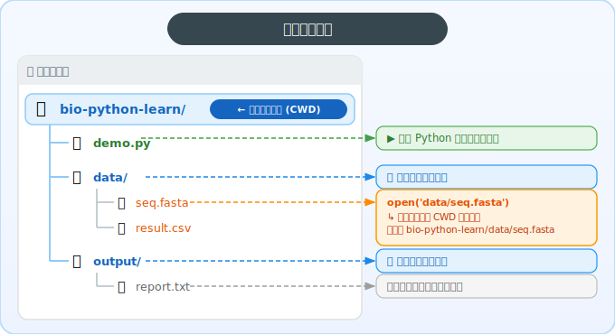
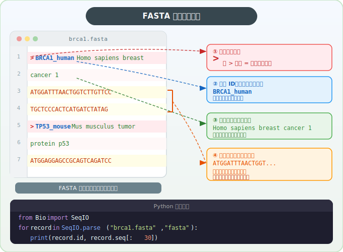
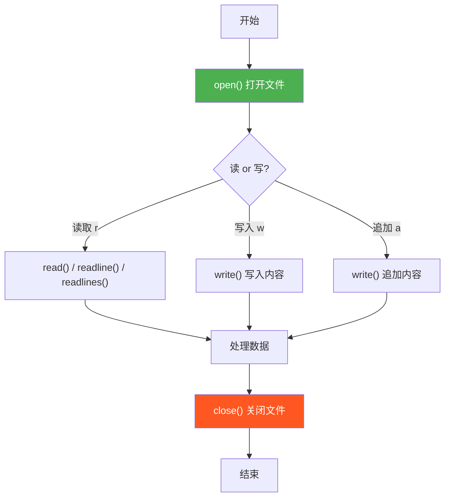
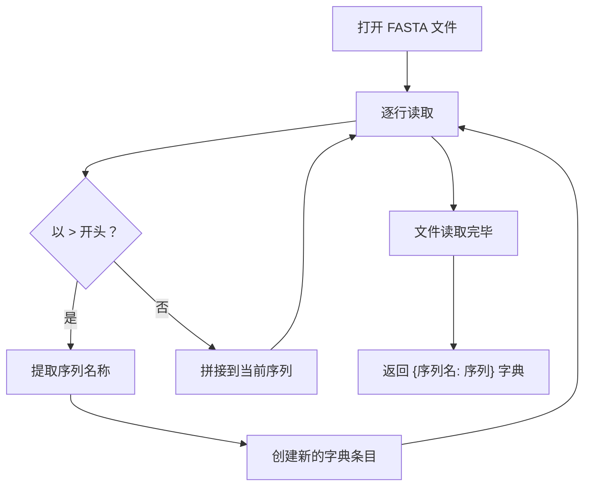

# 第5章：与文件对话 -- 文件读写与异常处理

## 5.1 文件路径：实验室里的文件柜

在实验室里，你要找一份实验报告，可能要这样描述它的位置：「三楼 -> 分子生物学实验室 -> 第二个文件柜 -> 第三层 -> PCR实验报告.pdf」。计算机里的文件也是这样——通过**路径**来定位。

### 绝对路径 vs 相对路径

| 类型     | 说明                   | 示例（macOS/Linux）                      | 示例（Windows）                         |
| -------- | ---------------------- | ---------------------------------------- | --------------------------------------- |
| 绝对路径 | 从"根目录"开始的完整路径 | `/Users/zhang/projects/data/seq.fasta`   | `C:\Users\zhang\projects\data\seq.fasta` |
| 相对路径 | 从"当前位置"出发的路径   | `data/seq.fasta`                         | `data\seq.fasta`                        |

**类比**：
- 绝对路径 = 「中国北京市海淀区XX路XX号」 -> 从哪里出发都能找到
- 相对路径 = 「往前走200米右转」 -> 要看你当前站在哪里

### 当前工作目录（核心概念）

当你在 VSCode 的终端里运行 `uv run python demo.py` 时，Python 的**当前工作目录**（Current Working Directory）就是你的项目文件夹。也就是说，代码里写的相对路径都是**相对于这个文件夹**的。



可以用 Python 验证当前目录：

```python
import os
print(os.getcwd())  # 输出当前工作目录，例如 /Users/zhang/bio-python-learn
```

> **排错第一步**：如果你运行脚本时遇到 `FileNotFoundError`，第一件事就是用 `print(os.getcwd())` 检查当前目录是否正确。大多数"找不到文件"的问题，原因都是你在错误的目录下运行了脚本。

> **建议**：在脚本中使用 `os.path` 来拼接路径，避免手写 `/` 或 `\`，这样代码在不同操作系统上都能正常运行。

```python
import os
# 推荐写法：自动适配操作系统的路径分隔符
file_path = os.path.join("data", "sequences.fasta")
```

---

## 5.2 文本文件读写

### 实际操作提示

在动手写代码之前，先确认两件事：

1. **文件放哪里**：把你要读取的数据文件放在项目文件夹下的 `data/` 目录中
2. **从哪里运行**：在 VSCode 中打开项目文件夹，然后在终端里运行 `uv run python 你的脚本.py`

### open() 函数：打开文件的三种方式

```python
open(文件路径, 模式)
```

| 模式 | 含义           | 类比                       |
| ---- | -------------- | -------------------------- |
| `"r"` | 读取（Read）   | 打开实验记录本查看         |
| `"w"` | 写入（Write）  | 拿一本新本子开始写（覆盖） |
| `"a"` | 追加（Append） | 在实验记录本末尾继续写     |

> **注意**：`"w"` 模式会**清空**原有内容再写入！如果你想在文件末尾添加内容，请用 `"a"`。

> **编码提示**：生信文件几乎都是 UTF-8 编码。为了避免中文路径或注释导致乱码，建议读写时都加上 `encoding='utf-8'`：`open("data.txt", "r", encoding="utf-8")`。

### with 语句：自动关门

打开一个文件后，用完了必须关闭它——就像离开实验室要关门。如果忘了关，可能会导致数据丢失或文件被锁住。

```python
# 不推荐：手动开关，容易忘记关闭
f = open("data.txt", "r")
content = f.read()
f.close()  # 容易忘！

# 推荐：with 语句自动关闭
with open("data.txt", "r") as f:
    content = f.read()
# 离开 with 代码块后，文件自动关闭
```

**类比**：`with` 就像实验室的自动门——你进去做实验，出来时门自动关上，不用操心。

### 读文件的三种方法

```python
# 方法1：一次性读取全部内容（适合小文件）
with open("data.txt", "r") as f:
    content = f.read()

# 方法2：逐行读取（适合处理大文件）
with open("data.txt", "r") as f:
    line = f.readline()

# 方法3：读取所有行，返回列表
with open("data.txt", "r") as f:
    lines = f.readlines()  # ["第一行\n", "第二行\n", ...]
```

> ⚠️ **注意**：每次 `f.read()` 会把文件指针移到末尾，之后再调用 `f.readline()` 就读不到内容了。所以三种方法需要分别打开文件，不能放在同一个 `with` 块里依次调用。

> **实际最常用的方式**：直接遍历文件对象，逐行处理，内存友好。

```python
with open("data.txt", "r") as f:
    for line in f:
        line = line.strip()  # 去掉行末的 \n 换行符（必须做！）
        print(line)
```

> **为什么需要 `strip()`？** 当你用 `for line in f` 逐行读取时，每一行末尾都会带着一个换行符 `\n`（就像按了回车键）。`strip()` 会把这个多余的换行符去掉，同时也会去掉行首行末的空格。如果不 `strip()`，你打印出来会发现行与行之间多了空行。

### 写文件

```python
with open("output.txt", "w") as f:
    f.write("序列名称: BRCA1\n")
    f.write("GC含量: 45.2%\n")
```

---

## 5.3 CSV 文件读写

CSV（Comma-Separated Values，逗号分隔值）是最常见的表格数据格式。用 Excel 或 WPS 打开就是一张表。

```
gene_name,length,gc_content
BRCA1,81189,45.2
TP53,19149,52.1
```

Python 标准库提供了 `csv` 模块来读写 CSV：

```python
import csv

# 写 CSV
with open("result.csv", "w", newline="") as f:
    writer = csv.writer(f)
    writer.writerow(["gene_name", "gc_content"])  # 写表头
    writer.writerow(["BRCA1", 45.2])
    writer.writerow(["TP53", 52.1])

# 读 CSV
with open("result.csv", "r") as f:
    reader = csv.reader(f)
    for row in reader:
        print(row)  # row 是一个列表，如 ['gene_name', 'gc_content']
```

> **预告**：后续章节我们会用 `pandas` 来处理 CSV，比 `csv` 模块更方便强大。

---

## 5.4 FASTA 格式（重点）

### 什么是 FASTA？

FASTA 是生物信息学中最常见的序列文件格式，用来存储 DNA、RNA 或蛋白质序列。

### 格式规则

```
>序列名称 描述信息
ATGCGTACGTACG
TTAGCGATCGATC
>另一条序列的名称
GGCCAATTGGCC
```

- 以 `>` 开头的行是**标题行**（header），包含序列名称和可选的描述
- 标题行之后的所有行是**序列内容**，直到遇到下一个 `>` 或文件结束
- 一条序列可以跨多行

### 图示：FASTA 文件内容详解



> **关于序列ID**：标题行中第一个空格之前的部分是**序列ID**（如 `BRCA1_human`），空格之后的是**描述信息**。很多生信工具（如 BLAST、samtools）只用第一个空格前的内容作为序列标识符，这个约定非常重要。

### 手写解析 FASTA

核心逻辑：逐行读取，遇到 `>` 就开始新序列，否则拼接到当前序列：

```python
def parse_fasta(filepath):
    """解析 FASTA 文件，返回字典 {序列名: 序列内容}"""
    sequences = {}
    current_name = None

    with open(filepath, "r") as f:
        for line in f:
            line = line.strip()
            if line.startswith(">"):
                # 标题行：提取序列名称（去掉 > 后保留完整描述）
                current_name = line[1:].strip()
                sequences[current_name] = ""
            else:
                # 序列行：拼接到当前序列
                sequences[current_name] += line

    return sequences
```

### 用 Biopython 解析 FASTA（推荐）

上面我们手写了 FASTA 解析器，目的是理解原理。在实际工作中，推荐使用专业的 **Biopython** 库——它就像分子生物学的瑞士军刀，处理各种生物数据格式既稳定又方便。

```bash
# 先在终端安装（只需一次）
uv add biopython
```

```python
from Bio import SeqIO

# 解析 FASTA 文件
for record in SeqIO.parse("data/sequences.fasta", "fasta"):
    print(f"ID: {record.id}")             # 序列ID，如 BRCA1_human
    print(f"描述: {record.description}")   # 完整标题行
    print(f"序列: {record.seq[:30]}...")    # 前30个碱基
    print(f"长度: {len(record.seq)} bp")
    print()
```

**Biopython vs 手写解析的对比**：

| 特性 | 手写 `parse_fasta()` | Biopython `SeqIO` |
|------|----------------------|---------------------|
| 学习价值 | 理解底层原理 | 学习专业工具用法 |
| 代码量 | 需要十几行 | 一行搞定 |
| 格式支持 | 仅 FASTA | FASTA/GenBank/EMBL/… 50+ 格式 |
| 容错能力 | 需自己处理边界情况 | 久经考验，稳定可靠 |

> **建议**：先动手写一遍手动解析（理解原理），以后实际工作中直接用 Biopython。这就像先学手动移液再用电动移液器——理解原理后，用工具才更得心应手。

---

## 5.5 异常处理：实验的应急预案

### 为什么需要异常处理？

做实验前我们总会想：如果某一步出了问题怎么办？比如：
- 培养基被污染了 -> 丢弃，重新配
- 试剂过期了 -> 换新试剂

写程序也一样——文件可能不存在、数据格式可能有误。**异常处理**就是程序的「应急预案」。

### 什么时候该用 try/except？

**原则**：当你的代码要和"外部世界"打交道时，就该考虑异常处理。

| 场景         | 是否需要 try/except | 理由                               |
| ------------ | ------------------- | ---------------------------------- |
| 读写文件     | 需要                | 文件可能不存在、没有权限           |
| 网络请求     | 需要                | 服务器可能超时、断网               |
| 用户输入     | 需要                | 用户可能输入非法值                 |
| 解析外部数据 | 需要                | 数据格式可能有误                   |
| 纯数学计算   | 通常不需要          | 如果输入合法，计算本身不会出错     |
| 列表/字典操作 | 通常不需要          | 先用 `if` 检查比 try/except 更清晰 |

> **简单记忆**：涉及文件、网络、用户输入 -> 用 try/except；纯内部逻辑 -> 用 if/else 提前检查。

### 常见错误类型

| 错误类型              | 什么时候发生                | 类比               |
| --------------------- | --------------------------- | ------------------ |
| `FileNotFoundError`   | 打开的文件不存在            | 找不到实验记录本   |
| `ValueError`          | 数据类型不对（如文本转数字）| 试剂浓度单位搞错   |
| `ZeroDivisionError`   | 除以零                      | 分母为零没有意义   |
| `KeyError`            | 字典中找不到指定的键        | 查密码子表查不到   |

### try/except 基本结构

```python
try:
    # 尝试执行的代码（可能出错的操作）
    with open("data.fasta", "r") as f:
        content = f.read()
except FileNotFoundError:
    # 如果文件不存在，执行这里的代码
    print("错误：找不到文件 data.fasta，请检查路径！")
```

### try/except/finally

`finally` 块里的代码**无论是否出错都会执行**，适合做清理工作：

```python
try:
    with open("data.fasta", "r") as f:
        content = f.read()
    print("文件读取成功！")
except FileNotFoundError:
    print("错误：文件不存在！")
finally:
    print("（无论成功与否，这条消息都会出现）")
```

### 捕获多种异常

```python
try:
    value = int("abc")  # 这会触发 ValueError
except FileNotFoundError:
    print("文件不存在！")
except ValueError:
    print("数据格式有误！")
```

---

## 5.6 文件读写流程总览



> **使用 `with` 语句时，步骤 H（关闭文件）会自动完成。**

### 解析 FASTA 的逻辑流程



---

## 5.7 本章小结

**核心要点**：

- **路径**：用 `os.path.join()` 拼接路径，代码更健壮；遇到 `FileNotFoundError` 先用 `print(os.getcwd())` 排查
- **文件读写**：`with open() as f` 是标准写法，自动管理文件关闭；逐行读取时记得 `strip()` 去掉换行符
- **FASTA 解析**：逐行读取 + 判断 `>` 开头 = 生信领域的基本功；注意区分序列ID和描述信息
- **异常处理**：`try/except` 让程序遇到错误时优雅应对；和外部资源打交道时使用


---

> **下一章预告**：第6章我们将学习 NumPy——Python 科学计算的基石。有了文件读写能力，我们可以把数据读进来；有了 NumPy，我们就能高效地对这些数据进行数值运算。
