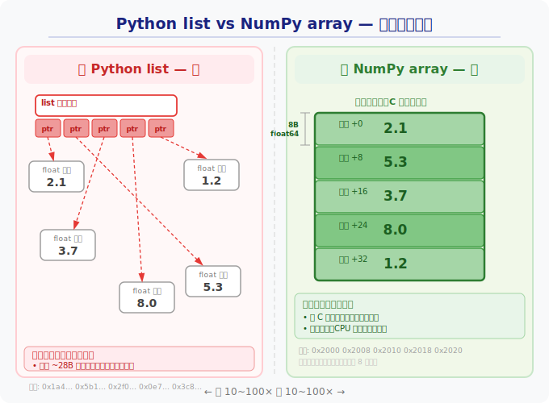
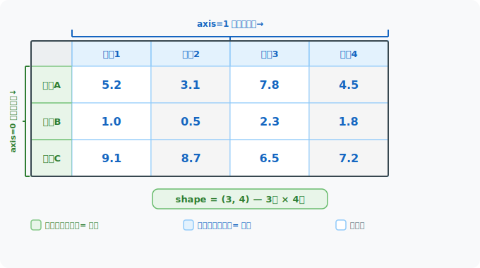
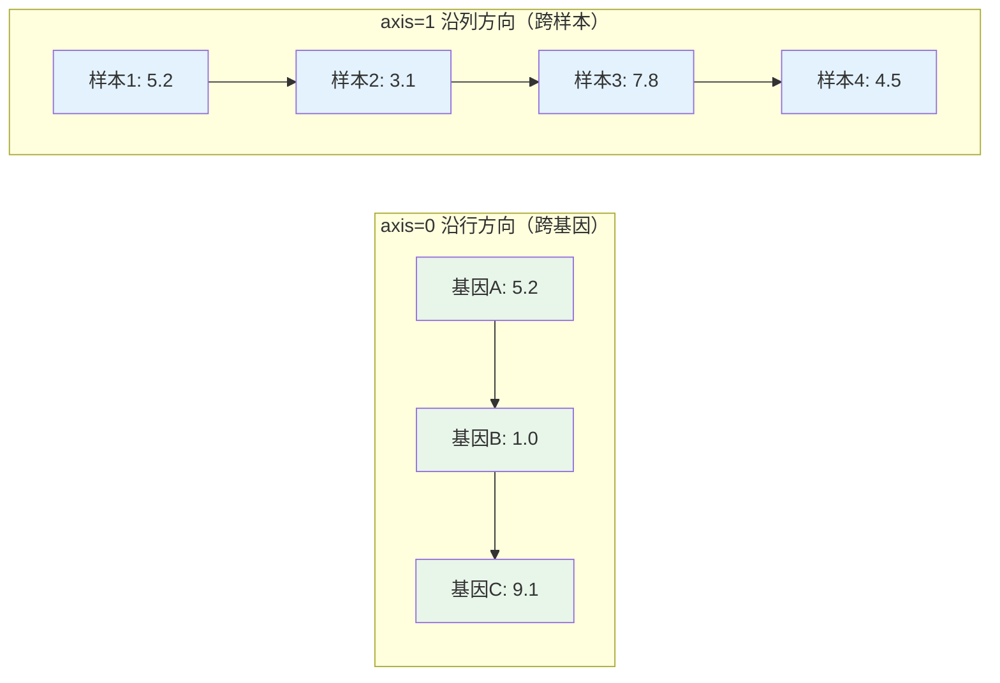
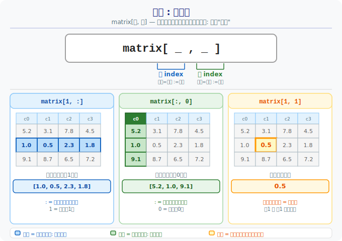
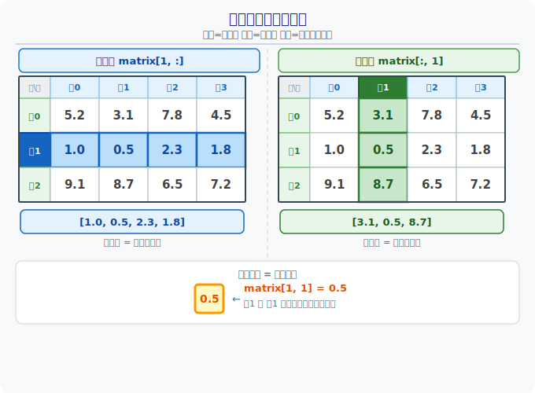
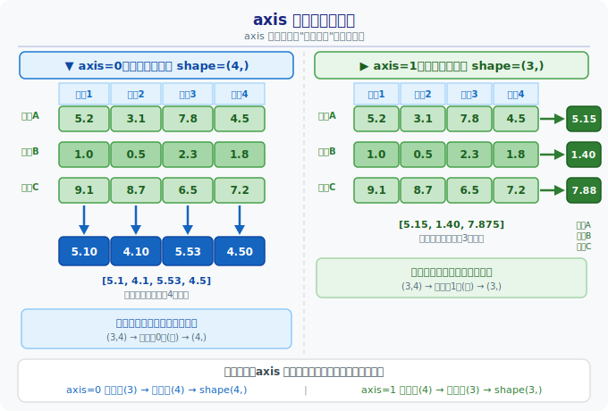

# 第6章：数值计算神器 -- NumPy 快速入门

> **回顾**：上一章我们学会了读写文件，能把 FASTA、CSV 等数据加载进 Python。但数据加载进来之后呢？如果你有 20000 个基因的表达量，用 list 逐个计算太慢了。这一章，我们学习用 NumPy 来高效处理这些数值数据。

## 6.1 为什么需要 NumPy？

### 类比：手工计数 vs 高通量测序

假设你有 20000 个基因的表达量数据，需要对每个值取对数、求均值、做标准化。

用 Python 原生 list，你只能写 for 循环逐个处理 -- 就像用移液枪一管一管地加试剂。
用 NumPy array，你可以一行代码批量完成 -- 就像用多通道移液枪，一次处理整排。

### Python list 的局限

```python
# 用 list 计算均值 -- 需要手动循环
values = [2.1, 5.3, 3.7, 8.0, 1.2]
total = 0
for v in values:
    total += v
mean = total / len(values)
```

问题：
- 代码冗长，每个操作都要写循环
- 速度慢（Python 循环逐个处理）
- 不支持批量数学运算（不能直接 `values * 2`）

### NumPy array 的优势

```python
import numpy as np   # 为什么写 as np？这是全世界约定俗成的缩写，
                     # 所有教程、论文、StackOverflow 都这样写。
                     # 你读别人的代码时看到 np 就知道是 NumPy。

values = np.array([2.1, 5.3, 3.7, 8.0, 1.2])
mean = values.mean()        # 一步求均值
doubled = values * 2        # 一步全部翻倍
log_values = np.log2(values) # 一步全部取 log2
```

优势总结：
- **代码简洁**：一行搞定批量运算
- **速度快**：底层用 C 语言实现，比 for 循环快 10~100 倍
- **功能丰富**：内置大量统计和数学函数

### list vs NumPy array：内存结构对比



> **关键限制**：为了实现连续内存存储，NumPy 数组的**所有元素必须是同一类型**（比如全是浮点数或全是整数）。而 Python list 可以混装不同类型（如 `[1, "hello", 3.14]`），NumPy 数组做不到这一点。

---

## 6.2 ndarray 数组基础

### 创建数组

```python
import numpy as np

# 从 list 创建
expr = np.array([2.1, 5.3, 3.7, 8.0, 1.2])

# 创建全零数组（常用于初始化结果矩阵）
zeros = np.zeros(5)          # [0. 0. 0. 0. 0.]

# 创建全一数组
ones = np.ones(3)            # [1. 1. 1.]

# 创建等差序列（类似 range，但返回数组）
steps = np.arange(0, 10, 2)  # [0 2 4 6 8]

# 创建均匀分布的点（常用于画图的X轴）
points = np.linspace(0, 1, 5) # [0.   0.25 0.5  0.75 1.  ]
```

### 数组的三个关键属性

```python
expr = np.array([2.1, 5.3, 3.7, 8.0, 1.2])

expr.shape  # (5,)      -- 形状：5个元素的一维数组
expr.ndim   # 1         -- 维度：1维
expr.dtype  # float64   -- 数据类型：64位浮点数
```

### 一维数组 vs 二维数组

**一维数组（1D）**：一个基因在多个样本中的表达量向量。

```python
gene_a = np.array([5.2, 3.1, 7.8, 4.5])  # 基因A在4个样本中的表达量
```

**二维数组（2D）**：多个基因 x 多个样本的表达矩阵 -- 生信分析中最常见的数据结构。

```python
# 3个基因 x 4个样本的表达矩阵
expr_matrix = np.array([
    [5.2, 3.1, 7.8, 4.5],  # 基因A
    [1.0, 0.5, 2.3, 1.8],  # 基因B
    [9.1, 8.7, 6.5, 7.2],  # 基因C
])
expr_matrix.shape  # (3, 4) -- 3行4列
expr_matrix.ndim   # 2      -- 二维
```

### 2D 数组结构示意图





> **记忆口诀**：`axis=0` 是"竖着压"（跨行/跨基因），`axis=1` 是"横着压"（跨列/跨样本）。

---

## 6.3 索引和切片

> 类比：数组索引就像从试管架上取第 N 个试管。

### 一维索引

```python
expr = np.array([5.2, 3.1, 7.8, 4.5, 6.0])

expr[0]     # 5.2   -- 第1个元素（从0开始计数）
expr[-1]    # 6.0   -- 最后一个元素
expr[1:3]   # [3.1, 7.8] -- 第2到第3个（左闭右开）
```

### 二维索引 [行, 列]

```python
matrix = np.array([
    [5.2, 3.1, 7.8, 4.5],
    [1.0, 0.5, 2.3, 1.8],
    [9.1, 8.7, 6.5, 7.2],
])

matrix[0, 2]    # 7.8   -- 第0行第2列（基因A在样本3的表达量）
matrix[1, :]    # [1.0, 0.5, 2.3, 1.8] -- 第1行所有列（基因B的全部表达量）
matrix[:, 0]    # [5.2, 1.0, 9.1]      -- 所有行第0列（样本1中所有基因的表达量）
matrix[0:2, :]  # 前2行（基因A和基因B的数据）
```

理解 `:` 的含义：





### 布尔索引（条件筛选）

> 类比：筛选高表达基因，就像用荧光阈值筛选阳性细胞。

```python
expr = np.array([5.2, 3.1, 7.8, 4.5, 1.2])

# 步骤1：生成布尔掩码
mask = expr > 4.0
# mask = [True, False, True, True, False]

# 步骤2：用掩码筛选
high_expr = expr[mask]
# high_expr = [5.2, 7.8, 4.5]

# 一步到位的简写
high_expr = expr[expr > 4.0]
```

---

## 6.4 数组运算

### 元素级运算

NumPy 数组的加减乘除是逐元素进行的，不需要写循环。

```python
a = np.array([1.0, 2.0, 3.0])
b = np.array([0.5, 1.5, 2.5])

a + b   # [1.5, 3.5, 5.5]
a - b   # [0.5, 0.5, 0.5]
a * b   # [0.5, 3.0, 7.5]
a / b   # [2.0, 1.333, 1.2]
```

### 与标量运算

数组可以直接和一个数字做运算，NumPy 会自动把这个数字应用到每个元素上。

```python
expr = np.array([10, 20, 40, 80])

expr / 10       # [1, 2, 4, 8]     -- 全部缩小10倍
expr + 1        # [11, 21, 41, 81] -- 全部加1（log转换前常用）
np.log2(expr)   # [3.32, 4.32, 5.32, 6.32]
```

### 广播机制（简介）

当两个不同形状的数组运算时，NumPy 会自动"广播"较小的数组来匹配较大的数组。

```python
# 表达矩阵 (3基因 x 4样本)
matrix = np.array([
    [10, 20, 30, 40],
    [5,  10, 15, 20],
    [2,   4,  6,  8],
])

# 每个基因的均值 (3个值)
gene_means = matrix.mean(axis=1, keepdims=True)  # shape (3, 1)

# 广播：(3,4) - (3,1) -> 每行减去各自的均值
centered = matrix - gene_means
```

> 目前只需理解：当一个维度为1时，NumPy 会自动扩展它来匹配另一个数组。

---

## 6.5 常用统计函数

```python
expr = np.array([5.2, 3.1, 7.8, 4.5, 1.2])

np.mean(expr)    # 或 expr.mean()   -- 均值: 4.36
np.std(expr)     # 或 expr.std()    -- 标准差: 2.18
np.min(expr)     # 或 expr.min()    -- 最小值: 1.2
np.max(expr)     # 或 expr.max()    -- 最大值: 7.8
np.sum(expr)     # 或 expr.sum()    -- 求和: 21.8
np.median(expr)  #                  -- 中位数: 4.5
```

### axis 参数：按行还是按列？

这是 NumPy 最重要也是初学者最容易困惑的概念。

**核心理解**：`axis` 参数指定的是被"压缩消除"的那个维度。

- `axis=0`：沿着行的方向**往下压缩**，把所有行压成一行 -> 结果是**每列一个值**（每个样本的统计值）
- `axis=1`：沿着列的方向**往右压缩**，把所有列压成一列 -> 结果是**每行一个值**（每个基因的统计值）

```python
matrix = np.array([
    [5.2, 3.1, 7.8, 4.5],  # 基因A
    [1.0, 0.5, 2.3, 1.8],  # 基因B
    [9.1, 8.7, 6.5, 7.2],  # 基因C
])

# axis=0：沿行方向计算（结果是每列的统计值 = 每个样本的均值）
matrix.mean(axis=0)  # [5.1, 4.1, 5.53, 4.5]  -- 4个值，对应4个样本

# axis=1：沿列方向计算（结果是每行的统计值 = 每个基因的均值）
matrix.mean(axis=1)  # [5.15, 1.4, 7.875]      -- 3个值，对应3个基因

# 不指定 axis：对所有元素计算
matrix.mean()        # 4.81   -- 全矩阵均值
```



> **助记**：看结果的形状就对了 -- 原矩阵 shape 是 (3, 4)，`axis=0` 压掉第0维（行），结果形状 (4,)；`axis=1` 压掉第1维（列），结果形状 (3,)。

---

## 本章小结

| 概念 | 说明 | 生物类比 |
|------|------|----------|
| `np.array()` | 创建数组 | 把数据装进标准化容器 |
| `shape` | 数组形状 | 表达矩阵的行数(基因)和列数(样本) |
| `array[条件]` | 布尔索引 | 按阈值筛选差异基因 |
| 元素级运算 | 批量计算 | 多通道移液枪同时操作 |
| `axis=0` | 沿行方向（跨基因） | 计算每个样本的统计值 |
| `axis=1` | 沿列方向（跨样本） | 计算每个基因的统计值 |

> **核心要点**：NumPy 让你用一行代码完成对整个数组的运算，抛弃 for 循环，像使用 Excel 公式一样高效地处理生物数据。记住两个关键限制：数组元素必须同类型，以及 `axis` 参数决定压缩方向。

---

## 下一步

学完 NumPy 数组操作后，下一章我们将进入 **Pandas** -- 它在 NumPy 之上加了行名和列名，让你的表达矩阵有了基因名和样本名，就像给 Excel 表格加上了表头。你会发现，Pandas 的很多操作（索引、统计、axis 参数）都和 NumPy 一脉相承，这一章打下的基础会让你学 Pandas 事半功倍。
