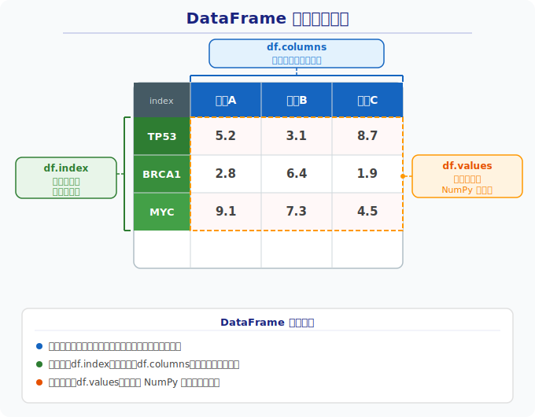

# 第7章：表格数据的好帮手 —— Pandas 入门

## 回顾与衔接：从 NumPy 到 Pandas

上一章我们学习了 NumPy，它擅长处理**纯数字矩阵**——比如一个 20000×100 的表达量矩阵。但 NumPy 有一个不方便的地方：它只有数字，没有"标签"。你需要自己记住"第0行是 TP53，第3列是样本D"。

**Pandas 就是在 NumPy 之上加了标签系统。** 事实上，DataFrame 的每一列本质上就是一个 NumPy 数组。

| 特性     | NumPy                | Pandas                      |
|----------|----------------------|-----------------------------|
| 数据形态 | 纯数字矩阵           | 带行名、列名的表格          |
| 类比     | 原始数据（只有数字）  | 带表头的实验记录本          |
| 适用场景 | 数学运算、矩阵计算    | 读取 CSV、筛选、分组统计    |

> **一句话总结**：NumPy 是引擎，Pandas 是方向盘。Pandas 让你用"基因名""样本名"来操作数据，而不用记编号。

---

## 7.1 Pandas 是什么？

**一句话定位**：Pandas 就是把 Excel 的功能搬到 Python 里，还能批量、自动化处理成千上万行数据。

在生物信息学中，我们经常面对这样的数据：

| 基因名 | 样本A | 样本B | 样本C |
|--------|-------|-------|-------|
| TP53   | 5.2   | 3.1   | 8.7   |
| BRCA1  | 2.8   | 6.4   | 1.9   |
| MYC    | 9.1   | 7.3   | 4.5   |

用 Excel 可以打开，但如果有 20000 个基因、100 个样本呢？手动操作就不现实了。Pandas 就是为此而生的。

```python
import pandas as pd  # 约定俗成的导入方式
```

---

## 7.2 Series —— 一列数据

**类比**：Excel 里的一列。

```python
# 创建一个 Series：5个基因的表达量
import pandas as pd

expression = pd.Series([5.2, 2.8, 9.1, 3.6, 7.0],
                       index=['TP53', 'BRCA1', 'MYC', 'EGFR', 'VEGFA'],
                       name='表达量')
print(expression)
# TP53     5.2
# BRCA1    2.8
# MYC      9.1
# EGFR     3.6
# VEGFA    7.0
# Name: 表达量, dtype: float64
```

**基本操作**：

```python
expression['TP53']        # 按名字取值 → 5.2
expression.mean()         # 平均值 → 5.54
expression > 5            # 逐元素比较，返回布尔 Series
expression[expression > 5]  # 筛选出表达量 > 5 的基因
```

---

## 7.3 DataFrame —— 二维表格

**类比**：Excel 里的一个工作表，有行有列。

### DataFrame 的三大组成部分



> **三要素**：`df.index`（行索引）、`df.columns`（列名）、`df.values`（底层 NumPy 数组）。

### Index（索引）概念

每个 DataFrame 都有行索引。默认是 0, 1, 2... 的整数编号，但也可以设置为有意义的标签（比如基因名）。

```python
# 默认索引：0, 1, 2 ...
df = pd.DataFrame({'基因': ['TP53', 'BRCA1'], '表达量': [5.2, 2.8]})
print(df.index)  # RangeIndex(start=0, stop=2, step=1)

# 把某列设为索引
df = df.set_index('基因')
print(df.index)  # Index(['TP53', 'BRCA1'], dtype='object', name='基因')

# 读取 CSV 时直接指定索引列（非常常用！）
df = pd.read_csv('gene_expression.csv', index_col=0)  # 把第一列设为行索引
```

### 创建 DataFrame

```python
import pandas as pd

data = {
    '基因名': ['TP53', 'BRCA1', 'MYC', 'EGFR', 'VEGFA'],
    '样本A':  [5.2,    2.8,    9.1,    3.6,    7.0],
    '样本B':  [3.1,    6.4,    7.3,    1.5,    4.2],
    '分组':   ['cancer', 'normal', 'cancer', 'normal', 'cancer']
}
df = pd.DataFrame(data)
print(df)
```

### 快速了解数据（5个必备方法）

| 方法            | 作用               | 类比                   |
|-----------------|--------------------|------------------------|
| `df.head()`     | 查看前5行          | 先瞄一眼数据长什么样   |
| `df.shape`      | 行数 × 列数        | 这张表多大？           |
| `df.columns`    | 所有列名           | 这张表有哪些字段？     |
| `df.dtypes`     | 每列的数据类型     | 哪些是数字、哪些是文本？|
| `df.describe()` | 数值列的统计摘要   | 快速看均值、最大最小值  |

### 读取和保存 CSV 文件

```python
# 读取 CSV（最常用的操作之一）
df = pd.read_csv('gene_expression.csv')

# 读取时把第一列设为索引（生信数据常见：第一列是基因名）
df = pd.read_csv('gene_expression.csv', index_col=0)

# 保存为 CSV
df.to_csv('result.csv', index=False)  # index=False 不保存行号
```

---

## 7.4 数据选择（重点！）

这是 Pandas 最核心的操作，务必掌握。

### 选列

```python
# 选一列 → 返回 Series
df['基因名']

# 选多列 → 返回 DataFrame（注意双层方括号）
df[['基因名', '样本A']]
```

### 选行：iloc vs loc

```python
# 按行号选（iloc = integer location）
df.iloc[0]      # 第0行
df.iloc[0:3]    # 第0~2行

# 按行名选（loc = label location）
df.loc['TP53']  # 标签为 'TP53' 的行（需要先 set_index）
```

> **类比理解**：
> - `iloc` 是**按座位编号点名**——"第1排第2个同学站起来"
> - `loc` 是**按姓名点名**——"叫 TP53 的同学站起来"

**iloc vs loc 对比表**：

| 特性       | `iloc`                     | `loc`                        |
|------------|----------------------------|------------------------------|
| 含义       | **i**nteger location       | **l**abel location           |
| 索引方式   | 整数位置（0, 1, 2...）     | 行/列标签名                  |
| 切片规则   | 左闭右开 `[0:3]` → 0,1,2  | 左闭右闭 `['A':'C']` → A,B,C |
| 示例       | `df.iloc[0, 1]`            | `df.loc['TP53', '样本A']`   |

> ⚠️ **注意**：当索引是默认的 0, 1, 2... 时，`iloc[0]` 和 `loc[0]` 结果相同，容易混淆。但一旦索引改成基因名，`iloc[0]` 仍然取第一行，而 `loc[0]` 会报错（因为没有叫 `0` 的标签）。此时必须用 `loc['TP53']`。

### 条件过滤（最实用！）

```python
# 筛选 cancer 组的样本
df[df['分组'] == 'cancer']

# 筛选样本A表达量 > 5 的基因
df[df['样本A'] > 5]

# 组合条件（& 表示"且"，| 表示"或"，每个条件要加括号）
df[(df['分组'] == 'cancer') & (df['样本A'] > 5)]
```

> **为什么用 `&`/`|` 而不是 `and`/`or`？**
>
> Python 的 `and`/`or` 只能比较**单个**布尔值（True or False），而 Pandas 的条件过滤是**逐行比较**，返回一整列布尔值。`&` 和 `|` 是按位运算符，能对整列布尔值逐个操作。简单记：**写 Pandas 条件时，永远用 `&` `|`，不用 `and` `or`。**

**`isin()` —— 一次筛选多个值**：

```python
# 筛选 TP53 或 MYC 基因（比写多个 == 用 | 连接更简洁）
target_genes = ['TP53', 'MYC', 'EGFR']
df[df['基因名'].isin(target_genes)]
```

---

## 7.5 数据清洗 —— 处理缺失值

真实数据里经常有缺失值（NaN），就像 Excel 里的空格。

```python
import numpy as np

# 人为制造一些缺失值
df.loc[1, '样本A'] = np.nan

# 查看每列有多少缺失值
df.isnull().sum()

# 方法1：用特定值填充缺失值（比如用0或该列均值）
df['样本A'].fillna(df['样本A'].mean())

# 方法2：直接删除含缺失值的行
df.dropna()
```

**选哪种方法？** 取决于分析目的：
- 表达量数据缺失 → 通常用均值/中位数填充
- 关键分组信息缺失 → 通常删除该行

---

## 7.6 分组统计 groupby

**类比**：把实验数据按"实验组 / 对照组"分开，分别统计结果。

```python
# 按 "分组" 列分组，计算每组样本A的平均表达量
df.groupby('分组')['样本A'].mean()
# cancer    7.10
# normal    3.20

# 一次性统计所有数值列的平均值
df.groupby('分组').mean(numeric_only=True)
```

这在比较 cancer vs normal 样本的基因表达差异时非常有用！

---

## 7.7 数据变形：melt() 简介

有时候我们需要把"宽格式"变成"长格式"。比如用 seaborn 画图时，通常要求数据是长格式。

```python
# 宽格式（每个样本一列）：
#   基因名   样本A   样本B
#   TP53     5.2     3.1
#   BRCA1    2.8     6.4

# 转为长格式（所有表达量放一列，样本名放另一列）：
df_long = df.melt(id_vars=['基因名'], value_vars=['样本A', '样本B'],
                  var_name='样本', value_name='表达量')
#   基因名   样本    表达量
#   TP53     样本A   5.2
#   BRCA1    样本A   2.8
#   TP53     样本B   3.1
#   BRCA1    样本B   6.4
```

> 💡 **一句话记忆**：`melt()` = 把多列"融化"成两列（变量名 + 值）。下一章用 seaborn 画图时会经常用到。

---

## 7.8 数据处理流程总览


---

## 7.9 本章小结

| 操作       | 代码                                  | 一句话说明             |
|------------|---------------------------------------|------------------------|
| 导入       | `import pandas as pd`                 | 固定写法               |
| 读数据     | `pd.read_csv('file.csv')`            | 从文件加载表格         |
| 设索引     | `pd.read_csv('f.csv', index_col=0)`  | 把第一列设为行索引     |
| 看概况     | `df.head()`, `df.shape`, `df.describe()` | 快速了解数据        |
| 选列       | `df['列名']`                          | 取一列                 |
| 按位置选行 | `df.iloc[行号]`                       | 按座位编号             |
| 按标签选行 | `df.loc['行名']`                      | 按姓名点名             |
| 条件过滤   | `df[df['列'] > 值]`                   | 筛选满足条件的行       |
| 多值筛选   | `df[df['列'].isin([值1, 值2])]`       | 一次筛选多个值         |
| 缺失值     | `df.fillna(值)`, `df.dropna()`        | 填充或删除缺失         |
| 分组统计   | `df.groupby('列').mean()`             | 按组算均值             |
| 宽转长     | `df.melt(...)`                        | 为画图准备长格式数据   |
| 保存       | `df.to_csv('file.csv')`              | 导出为文件             |

---

## 下章预告

掌握了 Pandas 的数据处理技能后，下一步自然是**把数据画出来**！第8章我们将学习 **Matplotlib 和 Seaborn 数据可视化**——用柱状图、箱线图、热力图等方式直观展示基因表达差异。到时候你就会发现，这一章学的 `groupby()`、`melt()` 正是画图前的"黄金搭档"。
