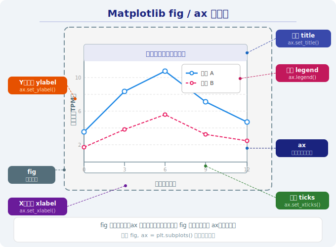
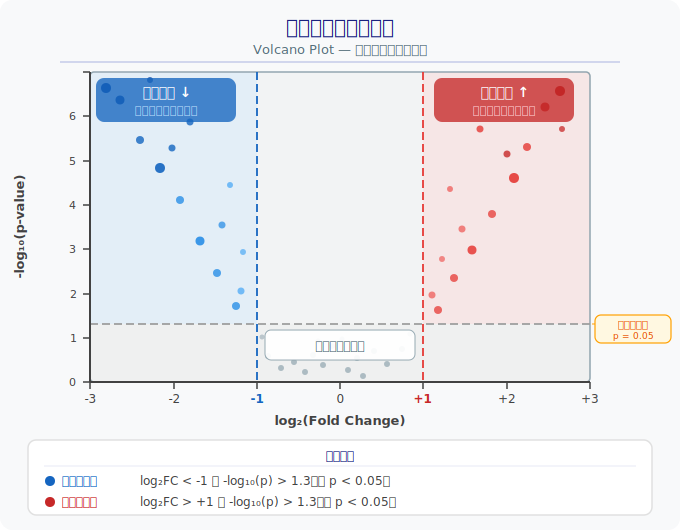

# 第8章：让数据"说话" —— 数据可视化

> **前情回顾**：在第7章中，我们学会了用 Pandas 读取、筛选、分组统计表格数据——现在你手里已经有了整理好的 DataFrame。但几千行数字盯再久也看不出规律。这一章，我们把数字变成**图**，让数据自己"开口说话"。

---

## 8.1 为什么需要可视化？

### 类比：显微镜让肉眼看不见的东西可见

一张基因表达矩阵有几千行几百列，光看数字你什么都发现不了 —— 就像用肉眼观察细胞切片，什么结构都看不清。

数据可视化就是你的**数据显微镜**：
- 一张热图，瞬间看出哪些基因在哪些样本中高表达
- 一张火山图，一眼找到差异显著的基因
- 一张散点图，立刻判断两个基因表达量是否相关

> **核心观点**：可视化不是"锦上添花"，而是数据分析的基本步骤。在生信领域，图就是结论的载体。

---

## 8.2 Matplotlib 基础

Matplotlib 是 Python 最基础、最通用的绘图库。几乎所有其他绘图库都建立在它之上。

### 画布与坐标轴：fig 和 ax

```python
import matplotlib.pyplot as plt

# fig = 整张画布（相当于一张白纸）
# ax  = 坐标轴（画布上的一个绘图区域）
fig, ax = plt.subplots()

# 在 ax 上绘图
ax.plot([1, 2, 3], [4, 5, 6])
ax.set_title("标题")
ax.set_xlabel("X轴")
ax.set_ylabel("Y轴")

plt.savefig("my_plot.png")
```

下面这张示意图标注了 Matplotlib 图形的所有关键元素，建议对照记忆：



> **记忆口诀**：`fig` 是画纸，`ax` 是画框，图画在画框里。

### 如何在 Win11 中看到生成的图片

这是新手最常遇到的困惑：代码跑完了，图去哪了？

**方式一：`plt.savefig()` 保存为文件（推荐）**

```python
plt.savefig("my_figure.png", dpi=150, bbox_inches='tight')
```

运行后，PNG 文件会出现在你的脚本所在目录。在 VSCode 中，**左侧文件树里找到该 PNG 文件，单击即可预览**。

**方式二：`plt.show()` 弹出窗口**

```python
plt.show()  # 弹出交互式窗口
```

在有图形界面的系统上（比如 Win11 桌面）会弹出一个窗口显示图片。但如果你在终端里运行脚本，窗口可能一闪而过或无法显示，所以**日常开发建议用 `savefig`**。

**方式三：无 GUI 环境（服务器/远程终端）**

如果你在没有图形界面的 Linux 服务器上跑代码，`plt.show()` 会直接报错。这时需要在导入 `matplotlib.pyplot` **之前**切换后端：

```python
import matplotlib
matplotlib.use('Agg')  # Agg 后端：只保存文件，不弹窗
import matplotlib.pyplot as plt
```

> **小结**：本地开发用 `savefig` + VSCode 预览最省心；服务器上加一行 `matplotlib.use('Agg')` 即可。

### 多子图

当需要把多张图放在一起对比时，用 `plt.subplots(nrows, ncols)` 创建多个 `ax`：

```python
fig, axes = plt.subplots(1, 3, figsize=(15, 4))  # 1行3列
axes[0].plot(...)     # 第1个子图
axes[1].scatter(...)  # 第2个子图
axes[2].bar(...)      # 第3个子图
```

---

## 8.3 基本图形类型

### 1. 折线图 `plt.plot()` —— 趋势变化

展示数据随连续变量（如时间）的变化趋势。

**生信场景**：基因表达量随时间点的变化。

```python
ax.plot(time_points, expression, marker='o')
```

### 2. 散点图 `plt.scatter()` —— 相关性

展示两个变量之间的关系，每个点代表一个观测值。

**生信场景**：两个基因表达量的相关性分析。

```python
ax.scatter(gene_a_expr, gene_b_expr, alpha=0.6)
```

### 3. 柱状图 `plt.bar()` —— 对比

用柱子的高度来比较不同类别的数值大小。

**生信场景**：不同样本中某基因的表达量对比。

```python
ax.bar(sample_names, expression_values)
```

### 4. 箱线图 `plt.boxplot()` / `sns.boxplot()` —— 分布

展示数据的中位数、四分位距、异常值等分布特征。

**生信场景**：比较不同组别的基因表达量分布。

```python
sns.boxplot(data=df, x="group", y="expression")
```

### 5. 热图 `sns.heatmap()` —— 矩阵可视化（生信标配！）

用颜色深浅表示矩阵中每个值的大小，一眼总览全局。

**生信场景**：基因表达矩阵、样本相关性矩阵、基因聚类结果。

```python
sns.heatmap(expr_matrix, cmap="RdBu_r", annot=True)
```

> **热图是生信论文中出现频率最高的图形之一**，几乎每篇转录组分析文章都会用到。

#### 热图关键参数详解

**`cmap`（颜色映射）—— 选对颜色很重要**

不同数据类型适合不同的配色方案：

| cmap 名称 | 适合场景 | 说明 |
|-----------|---------|------|
| `RdBu_r` | 有正有负的数据（如 log2FC） | 红=正，蓝=负，白=零，最直观 |
| `Blues` | 只有非负值（如计数、浓度） | 越深越大，简洁清晰 |
| `viridis` | 通用场景 | 对色盲友好，打印黑白也能分辨 |

**`vmin` / `vmax` —— 控制色阶范围**

默认情况下，颜色会自动映射到数据的最小值和最大值。但有时你需要手动控制：

```python
# 让颜色以 0 为中心对称（适合 log2FC 这类有正有负的数据）
sns.heatmap(data, cmap="RdBu_r", vmin=-3, vmax=3)
```

**`annot=True` —— 在格子里显示数值**

```python
# 小矩阵时非常有用，大矩阵（>20x20）就别开了，会密密麻麻
sns.heatmap(data, annot=True, fmt=".1f")  # fmt 控制小数位数
```

---

## 8.4 图表美化

一张好图应该让读者不看图注就能大致理解内容。

### 颜色与样式速查

**常用颜色名称**（Matplotlib 内置，直接用字符串即可）：

| 颜色名称 | 色值 | 适合场景 |
|---------|------|---------|
| `'steelblue'` | 钢蓝色 | 折线图、散点图默认首选 |
| `'salmon'` | 鲑鱼红 | 与蓝色搭配做对比 |
| `'seagreen'` | 海绿色 | 表示正常/健康组 |
| `'tomato'` | 番茄红 | 表示异常/疾病组 |
| `'gold'` | 金色 | 高亮标注 |
| `'gray'` | 灰色 | 不显著的背景数据 |

**一行代码美化全局样式**：

```python
plt.style.use('seaborn-v0_8-whitegrid')  # 清爽白底 + 网格线
```

其他常用风格：`'ggplot'`（R 语言风格）、`'bmh'`（学术风格）、`'dark_background'`（暗色主题）。

### 完整美化示例

```python
fig, ax = plt.subplots(figsize=(8, 5))

ax.plot(x, y, color='steelblue', linewidth=2, marker='o', label='TP53')

# 标题和轴标签
ax.set_title("TP53 表达量随时间变化", fontsize=14)
ax.set_xlabel("时间 (小时)", fontsize=12)
ax.set_ylabel("表达量 (TPM)", fontsize=12)

# 图例
ax.legend(fontsize=10)

# 网格线（辅助读数）
ax.grid(True, alpha=0.3)

# 刻度字体大小
ax.tick_params(labelsize=10)
```

### 保存图片

```python
# 保存为 PNG（最常用）
plt.savefig("my_figure.png", dpi=150, bbox_inches='tight')

# dpi：分辨率（150 适合屏幕查看，300 适合论文投稿）
# bbox_inches='tight'：自动裁剪多余白边
```

> **提示**：`plt.savefig()` 要在 `plt.show()` 之前调用，否则保存的是空白图。

---

## 8.5 Seaborn 简介

Seaborn 是对 Matplotlib 的高级封装 —— **同样的数据，更少的代码，更好看的图**。

| 对比 | Matplotlib | Seaborn |
|------|-----------|---------|
| 定位 | 底层绘图引擎 | 高级统计绘图 |
| 默认样式 | 朴素 | 美观 |
| 与 Pandas | 需要手动提取列 | 直接传 DataFrame |
| 适合场景 | 精细控制每个细节 | 快速做出好看的统计图 |

常用 Seaborn 函数：
- `sns.heatmap()` —— 热图
- `sns.boxplot()` —— 箱线图
- `sns.scatterplot()` —— 散点图（支持按类别着色）
- `sns.barplot()` —— 柱状图（自动加误差线）

> **建议**：日常分析用 Seaborn 快速出图，需要精细调整时切换到 Matplotlib。

---

## 8.6 火山图（Volcano Plot）—— 差异表达分析的核心图

火山图是生信中展示差异表达分析结果的**标配图形**。一张图同时展示两个关键信息：**变化幅度有多大**（效应量）和**结果有多可靠**（显著性）。

### 两个坐标轴的含义

**X 轴：log2(FoldChange) —— 表达量变化倍数的对数**

- FoldChange（FC）= 处理组表达量 / 对照组表达量
- 上调 2 倍 → FC=2 → log2(2)=**1**
- 下调 2 倍 → FC=0.5 → log2(0.5)=**-1**

> **为什么要取对数？** 因为原始 FC 是不对称的——上调 2 倍是 2，下调 2 倍是 0.5，在图上距离中心不一样远。取 log2 后，+1 和 -1 关于零点对称，上调下调在图上等距，一目了然。

**Y 轴：-log10(p-value) —— 统计显著性**

- p 值越小 → 结果越可靠 → -log10(p) 越大 → 点越靠上
- 例如：p=0.01 → -log10(0.01)=2，p=0.0001 → -log10(0.0001)=4

### 火山图的四个象限



- **右上角**（显著上调）：处理后表达量明显升高，且统计上可靠 → **核心关注基因**
- **左上角**（显著下调）：处理后表达量明显降低，且统计上可靠 → **同样值得关注**
- **下半部分**（不显著）：变化不可靠或幅度太小 → 通常用灰色表示，忽略

### 代码示例

```python
import numpy as np
import matplotlib.pyplot as plt

# 假设 df 有 log2FC 和 pvalue 两列（来自差异表达分析工具如 DESeq2）
log2fc = df['log2FC']
neg_log10p = -np.log10(df['pvalue'])

# 按阈值分组着色
colors = []
for fc, p in zip(log2fc, df['pvalue']):
    if p < 0.05 and fc > 1:
        colors.append('tomato')     # 显著上调 → 红色
    elif p < 0.05 and fc < -1:
        colors.append('steelblue')  # 显著下调 → 蓝色
    else:
        colors.append('gray')       # 不显著 → 灰色

fig, ax = plt.subplots(figsize=(8, 6))
ax.scatter(log2fc, neg_log10p, c=colors, alpha=0.6, s=10)

# 添加阈值线
ax.axhline(y=-np.log10(0.05), color='black', linestyle='--', linewidth=0.8)
ax.axvline(x=1, color='black', linestyle='--', linewidth=0.8)
ax.axvline(x=-1, color='black', linestyle='--', linewidth=0.8)

ax.set_xlabel("log2(Fold Change)", fontsize=12)
ax.set_ylabel("-log10(p-value)", fontsize=12)
ax.set_title("Volcano Plot：差异表达基因", fontsize=14)

plt.savefig("volcano_plot.png", dpi=150, bbox_inches='tight')
```

> **为什么叫"火山图"？** 因为显著差异的基因集中在图的左上和右上，形状像火山喷发。

---

## 8.7 可视化流程


**选图速查表**：

| 你想展示什么？ | 推荐图形 | 函数 |
|---------------|---------|------|
| 随时间的变化趋势 | 折线图 | `plt.plot()` |
| 两个变量的关系 | 散点图 | `plt.scatter()` |
| 不同类别的对比 | 柱状图 | `plt.bar()` |
| 数据的分布情况 | 箱线图 | `sns.boxplot()` |
| 矩阵整体模式 | 热图 | `sns.heatmap()` |
| 差异表达分析结果 | 火山图 | `plt.scatter()` + 阈值线 |

---

## 本章小结

| 概念 | 说明 | 生物类比 |
|------|------|----------|
| `fig, ax` | 画布和坐标轴 | 载玻片和视野 |
| `plt.plot()` | 折线图 | 基因表达时间曲线 |
| `plt.scatter()` | 散点图 | 基因相关性分析 |
| `sns.heatmap()` | 热图 | 表达矩阵全景图 |
| 火山图 | log2FC vs -log10(p) | 差异基因筛选的标配 |
| `plt.savefig()` | 保存图片 | 拍照保存显微镜下的图像 |
| Seaborn | Matplotlib 的高级封装 | 自动对焦的高级显微镜 |

> **核心要点**：选对图形类型是第一步，美化是第二步。好的可视化能让审稿人一眼看懂你的结论。

---

## 下一步

学会用图表展示数据后，下一章我们将进入 **机器学习入门** —— 让计算机从数据中自动发现规律。就像免疫系统通过接触病原体"学会"识别入侵者一样，机器学习算法通过训练数据"学会"分类肿瘤样本、预测基因功能。
