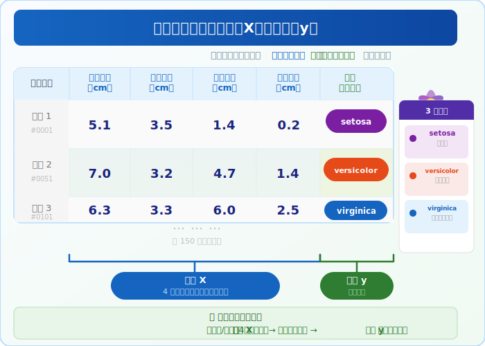
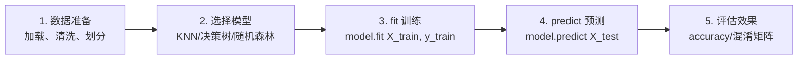
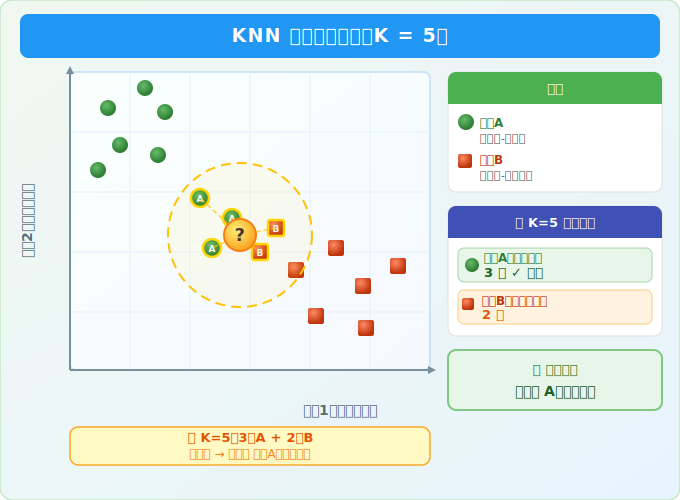
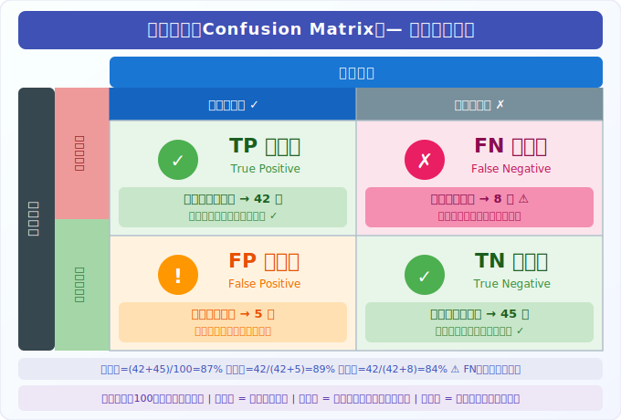

# 第9章：教机器"认识"数据 —— 机器学习入门

> **前情回顾**：在第8章中，我们学会了用 Matplotlib 和 Seaborn 将数据变成直观的图表。现在，我们要更进一步——让计算机自己从数据中**发现规律**、**做出预测**。

---

## 1. 什么是机器学习

### 生物类比：免疫系统如何学习

你的免疫系统从未上过"微生物学课"，但它能识别并消灭入侵的病原体。它靠的是**经验**——每次遇到新的病原体，免疫系统就记住它的特征（抗原），下次再遇到就能快速响应。

机器学习的原理完全一样：**让计算机从数据中自动学习规律，而不是由人类逐条编写规则。**

### 机器学习的核心：找规律

用一个最直觉的例子来理解：假设你在显微镜下看过 1000 张癌细胞图片和 1000 张正常细胞图片，久而久之你就能凭经验判断一张新图片是不是癌细胞。你的大脑在这个过程中自动总结出了一些模式——比如"细胞核更大、形状更不规则的倾向于癌变"。

机器学习就是把这个过程自动化：让计算机从大量已标注的数据中，自动总结出"什么样的特征组合倾向于什么结果"。

> **重要提醒：机器学习不是魔法。** 有一个经典原则叫 GIGO（Garbage In, Garbage Out，垃圾进垃圾出）——如果你喂给模型的数据质量差（标注错误、特征无意义、样本不够），再好的算法也学不出有用的规律。**数据质量永远是第一位的。**

### 传统编程 vs 机器学习

| 对比项 | 传统编程 | 机器学习 |
|--------|----------|----------|
| 输入 | 数据 + **人写的规则** | 数据 + **期望的输出** |
| 输出 | 结果 | **自动学到的规则（模型）** |
| 类比 | 查字典 | 学语言 |
| 适用场景 | 规则明确（BMI计算） | 规则复杂或未知（蛋白质结构预测） |

### 特征（Feature）和标签（Label）

在开始动手之前，先认识两个最核心的词汇：

- **特征 X**：描述每个样本的属性，即"用来判断的依据"
- **标签 y**：我们想预测的答案，即"最终的结论"

用一个表格来直观理解：



在生物信息学中，特征可以是基因表达量、蛋白质序列特征、细胞形态参数等；标签可以是"癌症/正常"、"耐药/敏感"等临床分类。

### 训练集与测试集

- **训练集** = 教科书：模型从中学习规律
- **测试集** = 期末考试：用模型没见过的数据检验学习效果

> 如果用考试原题来检验学生，你无法判断他是真的学会了，还是只是背了答案。机器学习同理——必须用模型没见过的数据来评估。

---

## 2. 监督学习 vs 无监督学习

| 类型 | 核心思路 | 生物类比 | 典型任务 |
|------|----------|----------|----------|
| **监督学习** | 给模型"带答案的样本"，让它学会预测 | 老师教你认标本：这是革兰氏阳性菌，那是阴性菌 | 分类、回归 |
| **无监督学习** | 只给数据，让模型自己发现结构 | 不告诉你菌落名称，让你自己按形态分组 | 聚类、降维 |

本章聚焦**监督学习中的分类问题**——这是生物信息学中最常用的机器学习任务。

---

## 3. scikit-learn 的统一工作流（重点）

scikit-learn（简称 sklearn）是 Python 最流行的机器学习库。它最大的优点是**所有算法都遵循相同的接口**——学会一个，就会用全部。

### 五步标准流程



### 代码模板（所有算法通用）

```python
from sklearn.某模块 import 某模型

# 第1步：准备好 X（特征）和 y（标签）
# 第2步：创建模型
model = 某模型()
# 第3步：用训练数据拟合模型
model.fit(X_train, y_train)
# 第4步：用模型对测试数据进行预测
y_pred = model.predict(X_test)
# 第5步：评估预测结果
accuracy = accuracy_score(y_test, y_pred)
```

> 记住这个流程，换任何算法都只需要改第2步的模型名称。

---

## 4. 常用分类算法

### KNN（K近邻）—— "近朱者赤"

找到离待分类样本最近的 K 个邻居，看这些邻居中哪个类别最多，就把样本归为那个类别。就像在一片草地上，如果你周围的5棵植物中有4棵是蒲公英，那你脚下这棵大概率也是蒲公英。



**K 值的选择很重要：**
- K **太小**（如 K=1）：只看最近的一个邻居，容易被噪声干扰 → 过拟合
- K **太大**（如 K=100）：考虑太多远处的样本，决策过于"平滑" → 欠拟合
- 实践中通常从 K=5 开始尝试，通过交叉验证找到最佳值

### 决策树 —— "分类检索表"

就像生物学中的二歧分类检索表：花瓣数量大于4？是 -> 走左边；否 -> 走右边。每个节点提出一个问题，逐步缩小范围，直到确定类别。

### 随机森林 —— "专家委员会投票"

建立多棵决策树，每棵树用略有不同的数据子集训练，最终由所有树投票决定分类结果。就像请多位分类学专家各自独立鉴定一个物种，最后采用多数意见——比单个专家更可靠。

---

## 5. 数据预处理

### 划分训练集和测试集

```python
from sklearn.model_selection import train_test_split

X_train, X_test, y_train, y_test = train_test_split(
    X, y, test_size=0.2, random_state=42
)
```

- `test_size=0.2`：20% 的数据留作测试
- `random_state=42`：设置随机种子，保证每次运行结果一致。就像实验中记录所有参数以确保**可重复性**——别人用同样的种子能得到完全相同的数据划分

### 特征标准化（StandardScaler）

**为什么需要标准化？** 假设你用"体重（kg）"和"身高（cm）"来分类动物。体重范围可能是 0.01~5000，而身高是 1~500。如果不标准化，体重的数值会"淹没"身高的贡献，导致模型偏向体重。

标准化将每个特征变换为均值为0、标准差为1的分布，让所有特征在同一尺度上公平竞争。

```python
from sklearn.preprocessing import StandardScaler

scaler = StandardScaler()
X_train_scaled = scaler.fit_transform(X_train)  # 在训练集上拟合并转换
X_test_scaled = scaler.transform(X_test)         # 在测试集上只转换（不重新拟合！）
```

> **警告：数据泄漏（Data Leakage）** 测试集只能用 `transform`，不能用 `fit_transform`。因为 `fit` 会计算均值和标准差——如果用测试集的数据参与计算，就等于让模型"偷看了考试答案"。这种信息泄漏会导致模型评估结果虚高，实际部署时性能骤降。**测试集的任何信息都不能参与训练过程。**

---

## 6. 模型评估

### 准确率（Accuracy）

最直观的指标：预测对了多少比例。

```python
from sklearn.metrics import accuracy_score
accuracy = accuracy_score(y_test, y_pred)
```

### 混淆矩阵（Confusion Matrix）

准确率只告诉你"总体对了多少"，混淆矩阵告诉你"哪些类别容易被搞混"。



- **TP（真阳性）**：确实有病，模型也说有病 → 正确
- **FN（假阴性）**：确实有病，模型却说没病 → **漏诊，最危险！**
- **FP（假阳性）**：没有病，模型却说有病 → 误诊，需要进一步检查
- **TN（真阴性）**：没有病，模型也说没病 → 正确

```python
from sklearn.metrics import confusion_matrix
cm = confusion_matrix(y_test, y_pred)
```

> **图示 vs 代码**：上面的 SVG 用二分类（癌症诊断）来讲解 TP/FP/TN/FN 的概念，因为二分类是理解混淆矩阵最直观的方式。而 `demo.py` 中使用的是 Iris 三分类数据集，它的混淆矩阵是 3×3 的——每个格子表示"真实类别 i 被预测为类别 j 的样本数"。概念完全相同，只是从 2×2 推广到了 N×N。

### 分类报告（Classification Report）

一次性输出每个类别的精确率、召回率和 F1 分数。

```python
from sklearn.metrics import classification_report
print(classification_report(y_test, y_pred))
```

- **精确率（Precision）**：预测为阳性的样本中，真正为阳性的比例
  - 类比：你告诉医生"这 10 个人有癌症"，其中真的有癌症的有几个？精确率关注的是**预测的可信度**
- **召回率（Recall）**：所有阳性样本中，被正确预测出来的比例
  - 类比：医院里一共有 100 个癌症患者，你的模型成功找出了多少个？召回率关注的是**有没有遗漏**
- **F1 分数**：精确率和召回率的调和平均值，二者的综合指标

> **医学场景中，召回率通常比精确率更重要。** 因为漏诊（FN）的代价远大于误诊（FP）——把一个癌症患者误判为正常，可能延误治疗危及生命；而把正常人误判为可疑，最多只是多做几个检查。这就是"宁可错杀一千，不可放过一个"的医学逻辑。

---

## 7. 常用生物信息学 Python 包

| 包名 | 用途 | 典型应用场景 |
|------|------|-------------|
| **scikit-learn** | 通用机器学习 | 分类、聚类、降维、特征选择 |
| **Biopython** | 生物序列分析 | FASTA/GenBank解析、BLAST调用、序列比对 |
| **scanpy** | 单细胞RNA-seq分析 | 细胞聚类、差异表达、轨迹分析 |
| **torch**（PyTorch） | 深度学习框架 | 蛋白质结构预测（AlphaFold2）、基因组变异检测 |
| **lifelines** | 生存分析 | 临床试验生存曲线、预后因素分析 |

---

## 本章小结

机器学习的核心思想很简单：**让计算机从数据中自动学习规律。** 掌握 sklearn 的五步工作流（准备数据 -> 选模型 -> fit -> predict -> 评估），你就拥有了解决大多数生物信息学分类问题的基本工具。

**下一步**：在第10章中，我们将把本章学到的所有知识整合起来，完成一个真实的乳腺癌诊断分类项目——你的毕业作品。
