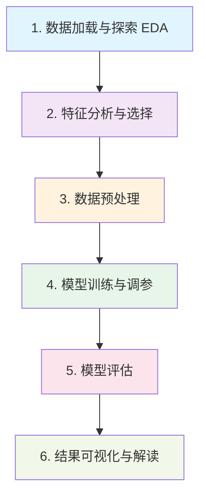

# 第10章：毕业项目 —— 乳腺癌肿瘤诊断分类

> 恭喜你走到了最后一章！这一章，我们将把前9章学到的所有技能整合起来，
> 完成一个**真实的生物信息学机器学习项目**。这不是练习，这是你的毕业作品。

> **前情回顾**：在第9章中，我们学习了机器学习的核心概念——特征与标签、训练与测试、评估指标。现在，是把这些知识应用到真实临床数据上的时候了。

---

## 10.1 项目背景：为什么这个项目重要？

### 乳腺癌分子分型的临床意义

乳腺癌是全球女性最常见的恶性肿瘤之一。不同的**分子亚型**（Luminal A、Luminal B、
HER2 阳性、三阴性等）对治疗方案的响应截然不同：

- **精准治疗**：分子分型直接决定患者是否需要化疗、靶向治疗或内分泌治疗
- **预后评估**：不同亚型的 5 年生存率差异显著
- **个体化医疗**：从"千人一方"到"一人一方"的关键一步

### 我们要做什么？

通过**细胞核的形态学测量特征**（这些特征本质上来自基因组学衍生的数字化病理分析），
构建机器学习模型来区分**恶性（malignant）** 和 **良性（benign）** 肿瘤。

这正是生物信息学家每天在做的事——用计算方法辅助临床诊断。

### 从图像到诊断：计算生物学在临床中的位置


> 注意最后一步是"辅助诊断"而非"替代医生"——ML 模型是医生的工具，不是医生的替代品。

---

## 10.2 数据集介绍

我们使用 scikit-learn 内置的 **Breast Cancer Wisconsin** 数据集：

| 属性 | 值 |
|------|-----|
| 样本数 | 569 |
| 特征数 | 30 |
| 类别 | 恶性 (212) / 良性 (357) |
| 特征来源 | 细胞核的数字化图像测量 |

### 30 个特征

对每个细胞核测量了 10 个基础特征，分别计算其**均值、标准误差、最大值**，共 30 个：

- **半径** (radius)：中心到边缘的平均距离
- **纹理** (texture)：灰度值的标准差
- **周长** (perimeter)
- **面积** (area)
- **光滑度** (smoothness)：半径变化的局部差异
- **紧凑度** (compactness)：周长² / 面积 - 1
- **凹度** (concavity)：轮廓凹陷部分的严重程度
- **凹点数** (concave points)：轮廓凹陷点的数量
- **对称性** (symmetry)
- **分形维数** (fractal dimension)：海岸线效应近似值

### 特征背后的生物学意义

这 30 个特征全部来自**细胞核的数字化病理图像**。为什么偏偏测量细胞核？因为细胞核形态的变化是癌变的重要标志物：

- 恶性肿瘤细胞往往具有**更大的细胞核**（半径、面积增大）
- 癌细胞核的**轮廓更不规则**（凹度、凹点数增加）
- 细胞核之间的**大小差异更显著**（标准误差和最大值偏大）

这些形态学异常本质上是**基因组不稳定性的宏观反映**——染色体异常、基因突变导致细胞分裂失控，从而在显微镜下呈现出可量化的形态变化。我们的 ML 模型正是要从这些量化指标中学习区分良恶性的规律。

---

## 10.3 完整项目流程



### 步骤详解

#### 1. 数据加载与探索（EDA）

- 加载数据，查看维度、类型、缺失值
- 了解样本分布：良性 vs 恶性的比例
- 计算基本统计量（均值、标准差、分位数）
- **关键问题**：数据是否平衡？有无异常值？

#### 2. 特征分析与选择

- 计算特征之间的相关性（相关性热图）
- 识别高度相关的冗余特征
- 选择与目标变量相关性最强的特征子集
- **关键问题**：哪些特征对分类最有帮助？

#### 3. 数据预处理

- 划分训练集和测试集（80/20）
- 特征标准化（StandardScaler）
- **注意**：只在训练集上 fit，再 transform 测试集，防止数据泄漏

#### 4. 模型训练与调参

**为什么要比较多个模型？** 机器学习领域有一个著名的"没有免费午餐定理"（No Free Lunch Theorem）：没有任何一种算法在所有问题上都是最好的。不同的数据结构、特征分布适合不同的算法，所以必须通过实验来比较。

训练多个模型进行对比：
  - **Logistic Regression**：线性模型基线
  - **Random Forest**：集成方法，可解释性好
  - **SVM**：擅长高维数据分类

**交叉验证（Cross-Validation）** 确保评估稳定可靠：

```
5折交叉验证示意：

第1轮: [验证] [训练] [训练] [训练] [训练]  → 得分 0.95
第2轮: [训练] [验证] [训练] [训练] [训练]  → 得分 0.93
第3轮: [训练] [训练] [验证] [训练] [训练]  → 得分 0.96
第4轮: [训练] [训练] [训练] [验证] [训练]  → 得分 0.94
第5轮: [训练] [训练] [训练] [训练] [验证]  → 得分 0.95

最终得分 = 平均值 ± 标准差 = 0.946 ± 0.011
```

把数据分成 5 份，每次用 4 份训练、1 份验证，轮流做 5 次取平均——比只做一次训练/测试划分更稳定，不会因为"恰好划分得好/差"而产生误导性的结果。

#### 5. 模型评估

- 准确率（Accuracy）
- 混淆矩阵（Confusion Matrix）：关注假阴性（漏诊）
- ROC 曲线 & AUC：综合衡量分类性能
- Classification Report：精确率、召回率、F1-score

**ROC 曲线的直觉理解：**

ROC 曲线的横轴是**假阳性率**（误诊率），纵轴是**真阳性率**（检出率）。曲线越靠近左上角，模型越好——意味着用很低的误诊率就能达到很高的检出率。AUC（曲线下面积）是一个汇总指标：1.0 表示完美分类，0.5 相当于随机猜测（抛硬币的水平）。

#### 6. 结果可视化与解读

- 特征重要性排名（Random Forest）
- 可视化模型性能对比
- **生物学解读**：最重要的特征在生物学上意味着什么？

---

## 10.4 关键要点

### 在生物信息学项目中要格外注意

1. **数据泄漏**：预处理必须在训练集上 fit，否则模型性能虚高
2. **类别不平衡**：在医学诊断中，假阴性（漏诊）比假阳性（误诊）更危险
3. **可解释性**：医生需要理解模型为什么做出这样的判断
4. **过拟合**：交叉验证是你的护身符

### 特征重要性的生物学解读

如果模型告诉你 `worst concave points`（最坏情况下的凹点数）是最重要的特征，这意味着什么？

在病理学中，细胞核轮廓的**凹陷程度**反映了核膜的不规则性，而这正是恶性肿瘤的经典形态学标志。凹点越多，说明细胞核形状越不规则，越可能是恶性细胞。**ML 模型"重新发现"了病理学家们早已知道的知识**——这既是对模型结果的验证，也说明模型学到了有生物学意义的规律，而不是在拟合噪声。

### 模型的局限性

在学术环境中，我们的模型可能达到 95%+ 的准确率，但距离真正的临床应用还有距离：

- 样本量有限（569 例），需要在**更大的数据集**上验证
- 数据来自单一中心，需要**多中心验证**以确保泛化能力
- 从研究到临床需要经过严格的**临床试验**审批
- 模型需要在不同人群、不同设备条件下保持稳定

> 诚实面对模型的局限性，是科学态度的体现，也是负责任的 AI 应用的基本要求。

### 工程实践

- 用**函数**组织代码，每个函数做一件事
- 保存所有可视化结果（论文/报告需要）
- 打印关键信息方便调试和记录

---

## 10.5 毕业寄语：学完了，你能做什么？

完成这个项目，你已经掌握了：

- Python 编程基础与工程实践
- NumPy / Pandas 数据处理
- Matplotlib / Seaborn 数据可视化
- scikit-learn 机器学习建模全流程

### 下一步可以探索的方向

| 方向 | 说明 |
|------|------|
| **深度学习** | PyTorch / TensorFlow，处理图像和序列数据 |
| **单细胞 RNA-seq 分析** | Scanpy，探索细胞异质性 |
| **空间转录组学** | Squidpy，空间基因表达分析 |
| **基因组变异分析** | Pysam / Cyvcf2，处理 BAM/VCF 文件 |
| **蛋白质结构预测** | AlphaFold / ESMFold，蛋白质序列与结构 |
| **生物网络分析** | NetworkX，基因调控网络与通路分析 |

### 写在最后

学完这个课程不意味着结束。真正的生物信息学工作充满了挑战——数据不干净需要反复清洗，模型表现不如预期需要反复调试，论文里的方法看不懂需要反复查阅。这些都是常态，每个生信从业者都经历过。

但你已经拥有了最重要的武器：**能够把生物问题转化为计算问题的思维方式**，以及**实际动手编写代码解决问题的能力**。这两样东西，比任何具体的算法或工具都更有价值——因为工具会更新换代，但解决问题的能力会伴随你整个科研生涯。

> **你不再是"学 Python 的生物学生"，你是"会用 Python 解决问题的生物信息学家"。**
>
> 毕业快乐！去创造属于你的东西吧。
